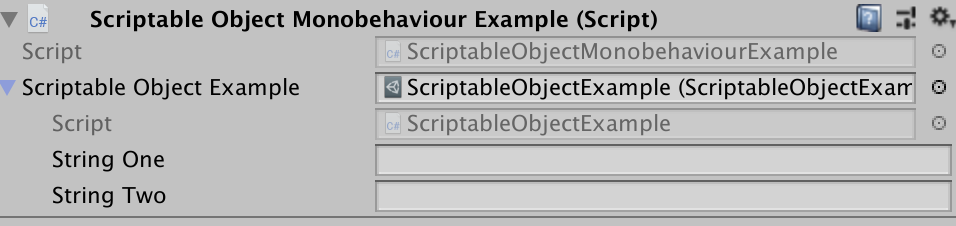

# [Able - Askowl Base Library Enabler](https://assetstore.unity.com/packages/slug/131162)

* Table of Contents
{:toc}
Download from the [Unity Store](https://assetstore.unity.com/packages/slug/131162)

## Executive Summary

`Able` has scripts needed by other ***Askowl*** libraries.
Use the maths section for time conversion, comparisons and trigonometry. Inspect data structures for with containers, caching, selectors, stack and trees.
If you have a need to read CSV or JSON data from an unknown source, review the text section.
For Unity3D support view scripts to aid testing, locate components and game objects, pluggable logging, and various editor display and runtime components.

> Read the code in the Examples Folder and run the Example scene.
>
> The Doxygen pages [here](https://paulmarrington.github.io/Unity-Documentation/Able/Doxygen/html/annotated.html)

## Introduction

Unity provides lots of great functionality, but always more problems than solutions. The solutions documented here were to solve problems in other Askowl libraries. They stand on their own when simple is not so simple. I have divided the scripts into four sections for Math, Data, Text and Unity.

Code compiled and tested in ***Unity3D 2018.3.0b1*** with C# set to `.NET 4.x Equivalent`

## Running the Able Integrity Tests

Loading the ***Able*** unity packages is all that is required to use any of the library functions. To run the Able unit tests requires a little more setup.

1. Open the scene *Assets/Askowl/Able/Examples/Askowl-Able-Examples*
   1. Select menu *File // Build Settings...* and;
   2. Press the *Add Open Scenes* button.
2. Press button *Player Settings...* on the bottom left of the build settings form then;
   1. Scroll down the Inspector window to the *Scripting Define Symbols* entry and;
   2. Enter *;Able;AskowlAble* to the end of the string.
   3. Select menu *File // Save*
      1. `;Askowl` will be added to the *Scripting Define Symbols*
3. Choose menu *Assets // Reimport All* and wait for the editor reload
4. Use the menu *Window // General // Test Runner* and;
   1. Press the *Edit Mode* button
   2. Press the *Run All* button
   3. Press the *Run Mode* button

## Maths functions

### Clock.cs - time & date conversions

#### Epoch Time

The creators of Unix invented Epoch time to represent time as seconds since the start of 1970 in a 32-bit integer. Dates wrap around in the year 2038 and suffered inaccuracy created by leap seconds. The conversion presented here is not 2038 limited. Leap seconds are an issue if you are using dates each side of an end of year correction - an unlikely event with minor implications.
```c#
DateTime now          = DateTime.Now;
double   epochTimeNow = Clock.EpochTimeNow;
double   epochTime    = Clock.EpochTimeAt(now);
AssertAlmostEqual(epochTime, epochTimeNow);

DateTime later          = now.AddDays(1);
double   epochTimeLater = Clock.EpochTimeAt(later);
AssertAlmostEqual(24 * 60 * 60, epochTimeLater - epochTimeNow);

var diff = later.Subtract(Clock.FromEpochTime(epochTimeLater));
AssertAlmostEqual(diff.TotalSeconds, 0);
```

##### double EpochTimeNow;

Epoch time is always UTC.

##### double EpochTimeAt(DateTime when);

Convert local time to UTC before translating to epoch time. Unlike Unix Epoch time, this result accounts for leap seconds.

##### DateTime FromEpochTime(double epochTime);

Convert back from Epoch UTC to local time, C# style.

### Compare.cs - almost equality

#### AlmostEqual for Floating Point

Floating point number comparisons can be hit or miss due to rounding. A single precision 32-bit float has around 7 digits of accuracy.  Even trivial calculations may not compare equal.

Enter `Compare.AlmostEqual`. You can specify the smallest change or use the defaults of 0.001 for single precision and 0.00001 for doubles.

```c#
IsFalse(Compare.AlmostEqual(a: 1.1f, b: 1.2f, minimumChange: 0.1f));
IsTrue(Compare.AlmostEqual(a: 1.1f,  b: 1.2f, minimumChange: 0.11f));

IsFalse(Compare.AlmostEqual(a: 1.1f, b: 1.11f));
IsTrue(Compare.AlmostEqual(a: 1.1f,  b: 1.0999f));

IsFalse(Compare.AlmostEqual(a: 103.11, b: 104, minimumChange: 0.5));
IsTrue(Compare.AlmostEqual(a: 103.11,  b: 104, minimumChange: 0.9));

IsFalse(Compare.AlmostEqual(a: 123.45678, b: 123.45679));
IsTrue(Compare.AlmostEqual(a: 123.456789, b: 123.45679));
```

#### AlmostEqual for Integers

Integers don't suffer from rounding problems but being close can have value.

```c#
IsFalse(Compare.AlmostEqual(a: 123L, b: 133L, minimumChange: 10L));
IsTrue(Compare.AlmostEqual(a: 123L,  b: 133L, minimumChange: 11L));

IsFalse(Compare.AlmostEqual(a: 123L, b: 125L));
IsFalse(Compare.AlmostEqual(a: 123L, b: 121L));
IsTrue(Compare.AlmostEqual(a: 123L,  b: 124L));
IsTrue(Compare.AlmostEqual(a: 123L,  b: 122L));

IsFalse(Compare.AlmostEqual(a: 1, b: 4, minimumChange: 2));
IsTrue(Compare.AlmostEqual(a: 1,  b: 3, minimumChange: 4));

IsFalse(Compare.AlmostEqual(a: 1, b: 4));
IsTrue(Compare.AlmostEqual(a: 1,  b: 2));
```

#### IsDigitsOnly

Check the contents of a string and return true if only digits.

```
Assert.IsTrue(Compare.isDigitsOnly("123987654"));

Assert.IsFalse(Compare.isDigitsOnly("12no shoe"));
Assert.IsFalse(Compare.isDigitsOnly("1.4"));
Assert.IsFalse(Compare.isDigitsOnly("-66"));
Assert.IsFalse(Compare.isDigitsOnly(""));
```

### [ExponentialMovingAverage.cs](https://en.wikipedia.org/wiki/Moving_average#Exponential_moving_average)

***<u>From Wikipedia</u>***:

> An **exponential moving average (EMA)**, called a **exponentially weighted moving average (EWMA)**,[[5\]](https://en.wikipedia.org/wiki/Moving_average#cite_note-5) is a first-order [infinite impulse response](https://en.wikipedia.org/wiki/Infinite_impulse_response) filter that applies weighting factors which decrease [exponentially](https://en.wikipedia.org/wiki/Exponential_decay). The weighting for each older [datum](https://en.wikipedia.org/wiki/Data) decreases, never reaching zero. The graph at right shows an example of the weight decrease.

 ***<u>From Me (Paul Marrington):</u>***

> An **exponential moving average** is a way to calculate an average where old values have less impact on the average than more recent ones.

Financial calculations often make use of EMA. So does IoT code. Many devices can give jittery readings. Real-world interactions make them inaccurate again. A compass or magnetometer will be affected by a mass of steel. EMA dampens the variations.

#### EMA Initialisation

The purest form is to create a new EMA object without parameters.

```c#
var ema = new ExponentialMovingAverage(); // lookback defaults to 9
```

As the comment says, the average is over the last 8 values plus the new one. You can set your own.

```c#
var ema = new ExponentialMovingAverage(lookback: 50);
```

The lookback value is application specific. Ask yourself how many data points are relevant to the current value. If you take one reading a second and any reading over 15 seconds old have no value, set lookback to 15.

#### EMA Average Value

If you don't make `Average` calls at consistent time intervals, you need to consider other methods to make the values equally spaced.

```c#
AreEqual(expected: 1f,      actual: ema.Average(value: 1));
AreEqual(expected: 2.6f,    actual: ema.Average(value: 5));
AreEqual(expected: 2.76f,   actual: ema.Average(value: 3));
AreEqual(expected: 4.056f,  actual: ema.Average(value: 6));
AreEqual(expected: 4.0336f, actual: ema.Average(value: 4));
```

#### EMA Average Angle

EMA used with angles in degrees is the same except with normalised results between -180 and +180 degrees.

```c#
AreEqual(expected: -10f,       actual: ema.AverageAngle(degrees: -10));
AreEqual(expected: -5.555555f, actual: ema.AverageAngle(degrees: 10));
AreEqual(expected: -5.432098f, actual: ema.AverageAngle(degrees: -5));
AreEqual(expected: -3.113854f, actual: ema.AverageAngle(degrees: 5));
AreEqual(expected: -3.088552f, actual: ema.AverageAngle(degrees: 357));
AreEqual(expected: -1.513316f, actual: ema.AverageAngle(degrees: 364));
```

### Geodetic.cs - distances & bearings

> **Geodesy**: The branch of mathematics dealing with the shape and area of the earth.
>
> **Origin**: late 16th century: from modern Latin geodaesia, from Greek geōdaisia, from gē ‘earth’ + daiein ‘divide’.
>
> https://en.wikipedia.org/wiki/Geodesy
> https://www.movable-type.co.uk/scripts/latlong.html

> **Paul's Definition**: Calculations of distances and bearings of and between two points on the earth's surface and accounting for the curvature of the earth.

#### Coordinates Data Structure

Separate coordinate definitions can be more efficient than burdening one definition with lots of irrelevant data.

In this world-view, coordinates use 64-bit double floating points for accuracy and are degrees or radians aware.

```c#
var location = Geodetic.Coords(-27.46850, 151.94379);
var same = Geodetic.Coords(-0.4794157656, 2.65191941345, radians: true);
location.ToRadians();
same.ToDegrees();
Debug.Log(same.ToString()); // -27.46850, 151.94379
```

#### Distance Between Two Points

In the geodetic parlance, the shortest distance between two points is an arc, not a straight line. This follows the curvature of the earth.

The `Kilometres(from, to)` method uses the Haversine formula to calculate the distance using a approximation of the earth's curvature.
For display convenience `DistanceBetween(from, to)` returns a string representation. If the distance is below one kilometre, the value is the number of metres (i.e. 43 m). For distances below ten kilometres, one decimal place (4.7 km) is adequate. Above ten the kilometres are whole numbers only (23 km).

#### Bearing Between Locations

When hiking, take a bearing between yourself and a known landmark and follow that bearing.
```c#
var degrees = Geodetic.BearingDegrees(from, to);
var radians = Geodetic.BearingRadians(from, to);
Assert.AreEqual(degrees, Trig.degrees(radians));
```

#### Find One Point from Another

The next navigational trick finds a destination knowing the bearing and distance. It is useful if you want to call an air-strike on an enemy position you are observing.

```c#
Geodetic.Destination(start: here, distanceKm: 1.2, bearingDegrees: 23.4);
```

### Quaternions.cs - adding features

Unity quaternion math needs more methods for augmented reality.

#### AroundAxis

Rotate a quaternion around the X, Y or Z axis by the number of degrees. Uses include a clock face, a compass or a merry-go-round.

```c#
// ... A
// rotate z axis for magnetic heading
attitude = attitude.AngleAxis(Trig.zAxis, compass.MagneticHeading);
// ... B
```

#### Inverse
`Inverse` changes direction of rotation. If you rotate a quaternion forward then back using the inverse you get back the original quaternion.
```c#
// C ...
mainCamera.transform.localRotation = attitude.Inverse();
```
#### LengthSquared

Length or size for a quaternion has no visual representation. Attitude and rotation algorithms need unit quaternions where the length squared approaches one.
#### Normalise
> We can compute a fast 1/sqrt(x) by using a tangent-line approximation to the function. It is similar to a simple 1-step Newton-Raphson iteration, and by tuning it for our specific case, we can achieve high accuracy for cheap. (A Newton-Raphson iteration is how specialised instruction sets as for 3DNow and SSE compute fast 1/sqrt).

|           http://www.cs.uky.edu/~cheng/cs633/quaternion.html |
| -----------------------------------------------------------: |
| **The Inner Product, March 2002<br>**Jonathan Blow ([jon@number-none.com](mailto:jon@number-none.com)) |

This version is on an average 20% faster than `normalised` as provided by Unity.

#### RightToLeftHanded

The rotational use of quaternions provides the direction in 3 dimensions and the rotation of the object. Think of an aeroplane flying. Given a point of reference, you can calculate the angle on the X, Y and Z planes. Now the aeroplane dips a wing and spins. The rotation direction has changed.
The sign of the rotation defines which way the aeroplane is spinning. This is called it's chirality. The choice of which rotation direction is positive is arbitrary. The gyroscope used in phones has right-hand chirality and Unity is left-handed.
```c#
Quaternion rotateTo = Device.Attitude.RightToLeftHanded(Trig.zAxis);
```
#### RotateBy
Unity uses left-handed chirality and the Z-axis for the forward direction. The iOS gyroscope, for example, is right-handed. We can reverse the Chirality (a fancy word for handed) by negating the offending axis and W.
```c#
var attitude = GPS.Attitude.RightToLeftHanded(Trig.zAxis);
```
#### SwitchAxis
Different IoT devices define different axes as forward. We need to pivot on the third axis by 90 degrees to correct. This reverses the chirality, but this function corrects for that.

```c#
// B ...
// Gyro Z axis is Unity camera Y.
attitude.SwitchAxis(pivot: Trig.xAxis)
// ... C
```

### Trig.cs

#### Direction

##### Trig.xAxis / yAxis / zAxis

When I prefer to use *X, Y, Z* instead of *right, up, forward* I use Trig.Direction values. These are unit directions with either the X, Y or Z part set 1 one to specify the axis.

##### X, Y and Z

Integers where one is non-zero to define an axis with recorded direction as 1 or -1.

##### Name

The name is a constant, being 'X', 'Y' or 'Z'. Used for switch statements where a character means more than using the ordinal value.
##### Ord
Ordinal value - the same as for `Vector3` - X=0, Y=1, Z=2. The values can be access by the ordinal value (i.e. Trig.xAxis[0] == 1).
##### Vector
When Unity provided functions want to describe a direction, they use constants inside `Vector3` such as `Vector3.up`. Use `Trig.Y.Vector` to give directions as XYZ.

##### VectorName

You can retrieve the name of the associated vector `Trig.Y.VectorName == "up"`.

##### OtherAxes
When we pivot we change the other axes. This field refers to two Directions. `Trig.xAxis.OtherAxes[0] == Trig.yAxis && Trig.xAxis.OtherAxes[1] == Trig.zAxis`.

##### Negative

`Vector3` sees positive as up. Right and Forward are positive. For `Trig.Direction`, use the unary minus as in `-Trig.xAxis`. OtherAxes for negative directions will themselves be negative. You can check if a direction is negative with `Trig.xAxis.Negative == false`.

Here is a slice of the unit tests for `Trig.xAxis` only.  Use these as a guide for what you can achieve.

```c#
var xAxis = Trig.xAxis;
var yAxis = Trig.yAxis;
var zAxis = Trig.zAxis;

Assert.AreEqual(1,             xAxis.X);
Assert.AreEqual(0,             xAxis.Y);
Assert.AreEqual(0,             xAxis.Z);
Assert.AreEqual(xAxis[0],      xAxis.X);
Assert.AreEqual(xAxis[1],      xAxis.Y);
Assert.AreEqual(xAxis[2],      xAxis.Z);
Assert.AreEqual('X',           xAxis.Name);
Assert.AreEqual("X Axis",      xAxis.ToString());
Assert.AreEqual(0,             xAxis.Ord);
Assert.AreEqual(Vector3.right, xAxis.Vector);
Assert.AreEqual("right",       xAxis.VectorName);
var otherAxes = xAxis.OtherAxes;
Assert.AreEqual(yAxis, otherAxes[0]);
Assert.AreEqual(zAxis, otherAxes[1]);

// Tests for negative
var minusX = -Trig.xAxis;
var minusY = -Trig.yAxis;
var minusZ = -Trig.zAxis;

Assert.IsFalse(xAxis.Negative);
Assert.IsTrue(minusX.Negative);
Assert.AreEqual(-1,           minusX.X);
Assert.AreEqual(0,            minusX.Y);
Assert.AreEqual(0,            minusX.Z);
Assert.AreEqual(minusX[0],    minusX.X);
Assert.AreEqual(minusX[1],    minusX.Y);
Assert.AreEqual(minusX[2],    minusX.Z);
Assert.AreEqual('X',          minusX.Name);
Assert.AreEqual("-X Axis",    minusX.ToString());
Assert.AreEqual(0,            minusX.Ord);
Assert.AreEqual(Vector3.left, minusX.Vector);
Assert.AreEqual("left",       minusX.VectorName);
otherAxes = minusX.OtherAxes;
Assert.AreEqual(minusY, otherAxes[0]);
Assert.AreEqual(minusZ, otherAxes[1]);
```

#### ToRadians

Convert a number in degrees to radians.

```c#
Assert.IsTrue(Compare.AlmostEqual(1.5708, Trig.ToRadians(90)));
```

#### ToDegrees
This method converts a value in radians back to degrees.

```c#
Assert.IsTrue(Compare.AlmostEqual(90, Trig.ToDegrees(1.5708), 1e5));
```

#### Relative Position from Distance & Bearing

Calculate a relative vector in two dimensions give the distance away and the angle or bearing.

##### RelativePositionFromAngle

Return the trigonometric angle where 0 degrees is +X, and 90 degrees is East or +1. Increasing angles move the result counter-clockwise.

```c#
expected.Set(3.3f, 0);
actual = Trig.RelativePositionFromBearing(3.3f, Trig.ToRadians(90));
AreEqual(expected, actual);
```

##### RelativePositionFromBearing

Return a compass bearing where 0 degrees in North or +Y and 90 degrees is East or +X. Increasing bearings move the result clockwise.

```c#
expected.Set(0, 3.3f);
actual = Trig.RelativePositionFromAngle(3.3f, Trig.ToRadians(90));
AreEqual(expected, actual);
```

## Data Structures

### Cached Instances

Even considering premature optimisation as evil, the garbage collector is your enemy. If you target VR or mobile platforms, garbage collection runs degrade the gaming for your players. Even for PC/Mac/Linux machines, your players may have lower powered machines.
Even the simple `ForEach` allocates some memory. This is the worst. A few areas allocating large chunks followed by lots of tiny chunks cause frequent collection runs with much-fragmented memory to investigate.

What can we do without slowing development of our game? When we are writing code, we can see where objects are being allocated/discarded. Cache them for reuse on deactivation.
Oh, so you want examples? Try these for size.
1. Nodes in tree structures
2. JSON, XML and CSV encoding and decoding
3. Events and emitters
4. Temporary instances used in repeating code

You get the idea.
When not to cache:

1. Classes that are rarely instantiated.
2. Classes you cannot reset for reuse. IEnumerable is one of those, so no caching coroutines.
3. Classes with larger data sets in very infrequent batches. They need judgement calls. A `Dictionary` or `Map` with 100 entries each with a payload of 100 bytes and an average key length of 5 uses 64k.  Cache the payloads, not the `Dictionary`.

The keyword `new` looks the same for classes and structs, but the latter uses the stack, not the heap.

The `Cache` class is static. We call classes without caching awareness *Cache Agnostic*. *Cache Aware* classes are more convenient and readable.

#### Cache Agnostic Usage

Agnostic usage is compact but is harder to read because if the static `Cache<Agnostic>` references.

```c#
// Contained in a static constructor. Only  run once
Cache<Agnostic>.CreateItem     = () =>  new Agnostic {State = "Created"};
Cache<Agnostic>.DeactivateItem = (item) => item.State =  "Deactivated";
Cache<Agnostic>.ReactivateItem = (item) => item.State += " Reactivated";

var agnostic = Cache<Agnostic>.Instance;
using (Cache<Agnostic>.Disposable(agnostic)) {
  Assert.AreEqual("Created", agnostic.State);
}
Assert.AreEqual("Deactivated", agnostic.State);
agnostic = Cache<Agnostic>.Instance;    // will retrieve recycled version
Assert.AreEqual("Deactivated Reactivated", agnostic.State);

var second = new Agnostic();
Cache<Agnostic>.Add(second);        // Add to cache after use
second = Cache<Agnostic>.Instance;    // Retrieve one again
Cache<Agnostic>.Dispose();            // and send it back again
```

#### Cache Aware Usage

A cache-aware class gives code is more explicit code. If you want to cache an unsealed class, you can even subclass and add the following functionality.

```c#
private class Aware : IDisposable {
  private static Aware CreateItem()     => new Aware {State = "Created"};
  private        void             DeactivateItem() => State = "Deactivated";
  private        void             ReactivateItem() => State += " Reactivated";

  private Aware() { }
  public static Aware Instance => Cache<Aware>.Instance;

  public string State { get; private set; }

  public void Dispose() { Cache<Aware>.Dispose(this); }
}
// ...
var aware = Aware.Instance;
using (aware) {
  Assert.AreEqual("Created", aware.State);
}
Assert.AreEqual("Deactivated", aware.State);
agnostic = Aware.Instance;    // will retrieve recycled version
Assert.AreEqual("Deactivated Reactivated", Aware.State);
aware.Dispose();
```

#### Cache Entry Maintenance
If the instance does not hold state, or you deactivate state in your code, the class can cache with no further work using `Cache<T>.Instance`. Disposal is important. If the class implements the `IDisposable` interface, the `using` statement is your best friend. If not, your code needs to use `Cache<T>.Dispose(instance)` or wrap in `using (Cache<T>.Disposable(instance)){}`.   An undisposed cached item makes a memory leak.

As with the underlying [`LinkedList`](#linked-lists), The [`CreateItem`](#create-a-new-linked-list), [`DeactivatItem`](#create-a-new-linked-list) and [`ReactivateItem`](#create-a-new-linked-list) come in three flavours.
1. Added as methods to a class (private or public);
2. Attached to a class so that instances can use them; or
3. Attached to an instance. In the latter case, only that specific instance have the methods. Now for the precedence.
1. A class with no actions attached runs the default as listed below, unless;
2. A class defines instance methods with the action name and signature, unless;
3. We have a static call instance action.

##### CreateItem
1. The class being cached must have an empty constructor.
2. The class has a method `static ClassName CreateItem(){}`
3. Set `Cache<T>.CreateItem` to a function without parameters that returns a new item.

```c#
public sealed class SealedClass {public int index;}
// Choice 1
var sealedClass1 = Cache<SealedClass>.Instance;    // sets index to 0
// Choice 2
public sealed class UnsealedClass {
    public int index;
    UnsealedClass CreateItem() => new UnsealedClass {index = 14};
}
var unsealedClass1 = Cache<UnsealedClass>.Instance;    // sets index to 14
// Choice 3
Cache<SealedClass>.CreateItem = () => new SealedClass {index=23};
var sealedClass2 = Cache<SealedClass>.Instance;    // sets index to 23
```

##### DeactivateItem

Item `Dispose` may not be correct when recycling, possibly due to an unclosed server connection, or a reference to a running prefab.

1. If the payload is an `IDisposable`, call `Dispose()` otherwise do nothing
2. The class has a method `static ClassName DeactivateItem(){doSomething();}`
3. Set `Cache<T>.DeactivateItem = (item) => item.doSomething()`
##### ReactivateItem
To reactivate an item needs activities such as reopening the connection or restarting the prefab. Use the same three options as above, but us `Reactivate`.
#### Using a Cached Item
A cache requires housekeeping. If a cached item gets forgotten, recycling fails, garbage disposal fails and the object remains on an active list. There is not a safe way using the garbage collector that does not end up making more garbage. Please prove me wrong.

For sequential code (even waiting for Coroutines meets this criterion), wrapping said code in `using` is the best choice.

```c#
var agnostic = Cache<Agnostic>.Instance;
using (Cache<Agnostic>.Disposable(agnostic)) {
  // ... work here ...
}
using (var aware = Aware.Instance) {
  // ... work here ...
}
```

Otherwise your responsibility is to call `Dispose`.

```c#
Agnostic agnostic;
void StartWork() {agnostic = Cache<Agnostic>.Instance;}
void EndWork() {Cache<Agnostic>.Dispose();}

Aware aware;
void StartWork() {aware = Aware.Instance;}
void EndWork() {aware.Dispose();}
```

If you used a cache item in a body of work, but not outside, you can use `ClearCache()` to send remaining active items to the recycle bin. Do this at the end of a scene. This example shows differences between CleanCache and Clea**r**Cache.

```c#
Cache<Agnostic>.Instance;
Cache<Agnostic>.ClearCache();
Assert.IsNull(Cache<Agnostic>.Entries.First);
Assert.IsNotNull(Cache<Agnostic>.Entries.RecycleBin.First);

Cache<Agnostic>.Instance;
Cache<Agnostic>.CleanCache();
Assert.IsNull(Cache<Agnostic>.Entries.First);
Assert.IsNull(Cache<Agnostic>.Entries.RecycleBin.First);
```
#### Boxing Value Types

C# generously wraps objects around basic value type so that they can be treated as object. The downside is load on the garbage collector. User defined value objects are called `struct` and are passed by value instead of reference. Used properly, `struct` instances do not use the heap or the garbage collector. Each entry has the interface `Boxed` for codes that need to distinguish value types from objects. There are two new methods.

1. ***New(T item)*** creates a new entry, inserts the value item and adds it to `Cache<T>.`
2. ***Clone(Boxed<T> item)*** creates a new entry and copies the value from an existing one.

Both use nodes from the recycling bin where possible.

In addition, useful methods are inherited from the Cache/LinkedList.Node, the most important being ***`Recycle()`***  to return an entry for later reuse.

***

### Disposable.cs for IDisposable

The  `using(...){...}` statement will call `Dispose` at the end of the following code block.
```c#
    [Test]
    public void DisposableExample() {
      using (Ephemeral()) {
        numberOfMonsters += 2;
      }
      Assert.AreEqual(expected: 0, actual: numberOfMonsters);
    }

    private IDisposable Ephemeral() =>
        new Disposable {Action = () => numberOfMonsters = 0};

    private int numberOfMonsters;
  }
```
#### Disposable with Payload
If we want to dispose of an object, we do not have direct access we need to add a payload.

```c#
public static Disposable<TreeContainer> DisposableInstance {
  get {
    var node = trees.Fetch();    // from cache in a LinkedList

    return new Disposable<TreeContainer> {
      Action = (tree) => {
        tree.Root();    // to dispose of all branches
        node.Dispose();    // calls LinkList Dispose
      },
      Payload = node.Item
    };
  }
}
// ...
using (var treeDisposable = TreeContainer.DisposableInstance) {
    var tree = treeDisposable.tree;
    // ... work with tree ...
} // Implicit dispose
```

`Disposable<T>` can be used two ways. Combine them to make three useful approaches.

1. ***Setting `Action`*** as above. Useful for sealed classes that do not have an `IDisposable` interface but need cleaning.
2. ***`IDisposable` Interface*** when the `PayLoad` has one. Call `Dispose()` on the `Disposable` passes to the `PayLoad` if available.
3. Use ***Both*** together. Think of where the `PayLoad` implements `IDisposable` but is part of a parent object wanting to be aware of a change in state.

```c#
  public void DisposableTWithDisposeAndAction() {
    var myClass = new Myclass();

    using (new Disposable<Myclass> {Payload = myClass, Action = Action}) {
      Assert.AreEqual("morning", myClass.howdie);
      myClass.howdie = "hi";
    }
    Assert.AreEqual("hi from me too", myClass.howdie);
  }

  void Action(Myclass myClass) { myClass.howdie += " too"; }
}

class Myclass : IDisposable {
  public string howdie = "morning";
  public void   Dispose() { howdie += " from me"; }
}
```

### Fifo Stacks
C# provides a serviceable `Stack` class. Even `LinkedList` from this package can offer a powerful stack. I think both are too heavy when we want a simple stack. This implementation is complete in under two dozen lines of code with unique features suitable for lightweight applications.

1. Instantiate with `Fifo<T>.Instance`.
2. Cache with `Dispose()` for later - reducing garbage collection.
3. Change the most recent item pushed with `Top` for dynamic data that needs a history.
4. Use `Next` to retrieve or update the second-in-line.
5. `Bottom` is used to retrieve or set the oldest item on the stack.
6. `Push` and `Pop` both return the current item making data with history easier to create.
7. `Swap` is a convenience method that swaps `Top` with `Next`.
8. `Count` will return the number of stack entries.
9. Set `Count` to reduce the number of entries on the stack.
10. A protected constructor allows inherited classes to bypass caching.
    The easiest way to show off the functionality is with the source to `CounterFifo`, a class that inherits from `Fifo<int>`.
#### CounterFifo
```c#
public class CounterFifo : Fifo<int> {
  public new static CounterFifo Instance => Cache<CounterFifo>.Instance;
  public int Start(int startingValue = 0) => Math.Abs(Push(startingValue));
  public int Next() => Math.Abs(++Top);
  public bool Reached(int bounds) {
    var reached = (Top >= bounds);
    if (reached) Pop();
    return reached;
  }
  public override void Dispose() { Cache<CounterStack>.Dispose(this); }
}
```

Thanks to `Fifo`, CounterFifo is a concise stack of counters providing an alternate form of iteration without garbage collection.
C# `foreach` causes lots of garbage to collect due to the state machine being generated by the compiler when a method returns `IEnumerator`. These functions do not reset, so cannot be reused or cached.
By providing methods `First` and `Next` in a class we can implement easy-to-use iteration with minimal garbage.
```c#
for (var key = map.First; key != null; key = map.Next) {
  Process(key, map[key]);
}
```
Here is the implementation in ***Map.cs***.
```c#
public object First => (Count > 0) ? keys[index.Start()] : null;
public object Next => index.Reached(Count - 1) ? null : keys[index.Next()];
private CounterFifo index = CounterFifo.Instance;
```
We could have just used `int index;`. In similar instances, we have problems when one iteration occurs in another. Besides, this is easier to read.
### Linked Lists
The goals of this linked lis implemention are:
1. Reduce garbage collection by keeping remaining nodes in a recycling list.
2. Ordered lists by providing a comparator.
3. Manage state with ***create***, ***deactivate*** and ***reactivate***.
4. All four support functions above allow inheritence or injection for class or instance.
5. State management by making it easy to move nodes between lists.
6. Fifo implementation.
7. Walk the list without creating a new or temporary object.
8. Support debugging by logging node movements.

#### Nodes

A node instance wraps each item added to a list. The node lives on the heap, but is recycled to reduce garbage collection activity.
##### Node Name
For clarity, while debugging a node name includes the home and owner lists and whatever the held item gives `ToString()`.
##### Node Owner and Home
We create a node on the `Home` list where it is returned when recycled. The `Owner`  is assigned each time a node moves to another list.
##### Node Comparison
Every node implements <, <=, >, >=, == and !=. They all rely on a single LinkedList function, `Compare`  as set during initialisation.
##### Move the Node to Another List

Moving nodes provides the core difference between this linked list implementation and others. A caching state machine can be created by moving nodes between lists. Use with ordered lists to feed them to a state in priority order. `MoveTo` moves the current node to the sorted location or top of the target list, while `MoveToEndOf` moves to the bottom.  Older items from the recycle bin  are first to reactivate.

##### Update Node Contents

In a statement oriented world we would use `node.Item = value`, but we can also enjoye a functional approach with `node.MoveTo(state3list).Update(value)`.
##### Dispose of this Node
Call `Recycle()` or wrap in a `using` compound statement to release a node.
```c#
using (var node = taskList.Top) {
    Process(node.Item);
} // node sent to recycling
```
To set a node adrift call `Destroy` instead to deactivate the held item and then forgets the node ever existed. As soon as all references in your code go out of scope, the garbage collector is free to reuse the heap space.

```c#
taskList.Top.Destroy();
```
When `Destroy` is called all entries in both active and recycle bin lists are discarded.
##### Fetch a New Node

`Fetch` pulls a new (or recycled) node iscurrent node's `Home` list then moved to `Owner`. If that is not your requirement, use `node.Home.Fetch()` or `node.Owner.Fetch()`.

##### Push an Item to Owner

Create a  node for the entry item provided with the same `Home` and `Owner` as the current node.
##### Add Another Item

For convenience in chaining `Node` has an `Add` method. The first add is from `LinkedList` while the rest are from the inner `Node` class.

```c#
list.Add("One").Add("Two").Add("Three");
```

#### Create a New Linked List

Creation defines how the linked list behaves.

##### Unordered Lists & FIFO Stacks

An item becomes the `Top` element when added. `Bottom` is the oldest entry.

```c#
var numberList = new LinkedList<int>();
Assert.AreEqual(expected: 0, actual: numberList.New());
```

##### Custom Create, Deactivate & Reactivate
Implicit creation returns `default(T)` (being zeros or null references). For more control, implement custom methods.
```c#
var connections = new LinkedList<Connection>{
    CreateItem     = () => new Connection(myURL);
    ReactivateItem = (node) => node.Item.CheckForStaleConnections();
    DeactivateItem = (node) => node.Item.SetLowPowerState();
};
// ...
using (var node = connections.Fetch()) {
    response = node.Item.Ask(requestData);
}
```

This example is ignoring the asynchronous nature of the request and the possibility that the connection has timed out.
`DeactivateItem` will not call `Dispose()` on `IDisposable` instances. If the item needs reactivation when retrieved for reuse, set an activation parameter as above.
Before node recycling, we call `DeactivateItem(node)`.
You can create all three custom functions in different ways, depending on need.
```c#
// 1. per-class/struct/value-type
LinkedList<int>.CreateItemStatic     = () => -1;
LinkedList<int>.DeactivateItemStatic = (node) => node.Item = -2;
LinkedList<int>.ReactivateItemStatic = (node) => node.Item = -1;
LinkedList<int>.CompareItemStatic = (a, b) => a.CompareTo(b);
// 2. inherited
private class MyClass {
    private static MyClass CreateItem() => new MyClass {State = "C"};
    private void DeactivateItem() => State = "D";
    private void ReactivateItem() => State = "R";
    int CompareItem(MyClass a, MyClass b) => a.State.CompareTo(b.State);
    public int State;
}
// 3. per-instance control
var numbers = new LinkedList<int> {
    Name           = "My Linked List"
    CreateItem     = () => -1;
    DeactivateItem = (node) => node.Item = -2;
    ReactivateItem = (node) => node.Item = -1;
    CompareItem    = (left, right) => left.CompareTo(right);
}
```

The static methods are active for any items of that class unless a per-instance invocation overrides them.

Inherited methods are active for any items of that class unless a per-instance or static invocation override them.

Per-instance invocations only affect one instance of a linked list.

##### Ordered Linked Lists

Caching state machines need a list of jobs in priority order. Priority could be a time, a distance or any other measure we can compare.

```c#
var fences = new LinkedLisk<Geofence> {
    CompareItem = (left, right) 
        => node.Item.Distance.CompareTo(cursor.Item.Distance)
}
// fences nodes now have <, <=, >, >=, == and !=
if (fence.Active) fence.MoveTo(fences);    // injects in sorted order
```
List order is maintained when creating new or moving existing items. `CompareItem` is required.

#### List Disposal

Use linked lists as statics to keep reusable elements. When an elemement is no longer deeded, discard or dispose of it.
1. `Discard()` disposes of any active elements, placing them in the recycle bin for later use. Use when you want to keep the linked list, but remove any outstanding elements. Called if an Item in a parent LinkedList.
2. `Dispose()` removes items from the recycle bin as well so that the linked list can be safe for the garbage collector to retrieve.

#### Node Creation and Movement

##### Add an Item
Add uses the recycle bin.
```c#
var node = fences.Add(newFence).Add(anotherFence);
```

##### Recycle a Node

Use `GetRecycledOrNew` if you need a node with contents initialised elsewhere.
```c#
using (node = weatherEvents.Fetch()) {
    node.Item.UseMe();
}
```

##### Move Item Between Lists

So now we get to the part where the real magic happens. Different components can own lists of Jobs. When they have done they can toss the job (node) to the next waiting part.

```c#
void Update() {
    if (! jobs.Empty) {
        var result = jobs.First.Item;
        if (result == null) {
            jobs.First.Discard(); // could have used jobs.Pop()
        } else {
            jobs.First.MoveTo(dispatcherList);
        }
    }
}
```

In this theoretical example, once we have processed a job we mark finished or put on another job list for a dispatcher to decide what to do next. Note that this example only works with small numbers of jobs, processing between 30 and 60 jobs a second.

There is a function to move to the end of a list for better dispersal of usage (LRU - least used). It can be used to move an item to the end of the list regardless of priority.

```c#
var result = jobs.First.Item;
if (result == null) {
    jobs.First.Discard(); // could have used Pop()
} else if (jobs.IHateThisPerson) {
    jobs.First.MoveToEnd(jobs);    // will never get processed
}
```

##### Disposal of a Node

Disposing of a node calls `Dispose()` on `IDiposable` item, moving to the `Home` recycle bin.

If an item has a known lifetime then by far the best way is with a `using` statement, having a guarantee of execution. If the work requires waiting for resources, then put the `using` statement in a Coroutine.

```c#
IEnumerator MyCoroutine() {
    using (var node = jobList.Fetch()) {
        while (!node.Item.Ready) yield return null;
        Process(node.Item);
    }
} // place back in recycling after Dispose()
```

Sometimes we do not know the lifetime of an item beforehand. Here, whoever does needs to calls `Dispose()`.

#### A Lifo Stack

***Lifo*** is an acronym for *Last in first out*. Stack-based languages such as FORTH and FICL make working with Lifo an art form of efficiency (and unreadability). We use Lifo stacks every day for undo operations when editing.

##### First
`First` is the standard entry to the linked list, so using Top has no overhead. `First` is null for an empty list. `First` allows access to the first item for processing before deciding on move or discard. Don't expect `First` to stay when you yield or otherwise relinquish the CPU.

```c#
var working = new LinkedList<MyWorld>();
// ...
var node = readyList.First?.MoveTo(working);
if (node != null) {
    yield return WaitForWorld(node);
    node.Dispose();
}
```

`First?.MoveTo` ensures that the readyList only provides a node if not empty.

##### Second

`Second` is the second entry below `First`, being null if the list has one entry or is empty.

##### Last
`Last` is the other less visited end of the stack/linked list. Great for anyone who likes burning the candle from both ends. The `MoveToEnd` method makes a node the new Last.

##### Empty

A better  `First` implementation:

```c#
var working = new LinkedList<MyWorld>();
// ...
if (! readyList.Empty) {
    using (var node = readyList.Top.MoveTo(working)) {
        yield return WaitForWorld(node);
    }
}
```

For this example, both methods are identical because `yield` does not pass back exceptions, so `using` has no benefit over a manual `dispose`.

##### Count

`Count` keeps a tally of active nodes.

##### Push

`Push` will also moving a node. You can push an item or a node onto a stack.

```c#
var node = idleList.Pop();
dispatchList.Push(node);
// ...
var myItem = new MyItem();
dispatchList.Push(myItem);
```

##### Pop

`Pop` places a node inin the recycle bin before returning a reference. Processing should occur before the next implicit or explicit yield. You need not dispose of the node.

```c#
using (var node = taskList.Top) {
    Process(node.Item);
} // node sent to recycling
// ... is the same as
node = taskList.Pop();
Process(node.Item);
```

This is better because you are free to move the node without it being moved back to the recycle bin for you.

#### Node Walking

Sing to the melody of *Jive Walking*.

```c#
var tasks = new LinkedList<Task> {
    CompareNodes = (left, right) => left.Item.Ready <= right.Item.Ready
}
// ...
tasks.Add(new Task {Ready=Time.RealtimeSinceStartup + 60});    // 1 minute
// ...
void Update() {
    for (var node = tasks.First; node != null; node = node.Next) {
        Check(node.Item);
    }
}
```

 Think of a list of tasks where only tasks that have exceeded their use-by date processed. Because we want to discard the node when done, we need to keep a reference to Next.

```c#
void Update() {
      var next = node.Next;
      for (node = list1.First; node != null; node = next, next = node.Next) {
        if (node.Item.Ready >= Time.RealtimeSinceStartup) break;
        using (node) { Process(node.Item); } // discarde afterwards
}
```

Inside a `using` statement `Dispose` has a guarantee of execution.

#### Debug Mode

Because we can use linked lists in a cached state machine, knowing where a task is going can be an essential part of understanding the functionality.

##### Name

Refers to the name of the list as provided in the constructor, defaulting to the name of the item type followed by an ordinal number.

##### DebugMode

When enabled, `DebugMode` causes a log entry for every creation or movement of a node.

##### Dump

`Dump` returns the current contents of a linked list as a multi-line formatted string.

##### ToString

Returns a string containing the list name and counts entry counts.

### Map - A Dictionary Wrapper

Underneath, a `Map` is still a C# `Dictionary` with similar object references for keys and values. This allows conversion for mixed types.

My limited tests show that the `Dictionary` is faster than `SortedList`. The latter uses `Array.BinarySearch` to find entries. I have read other performance tests that report binary searches to be faster for small numbers of keys. I checked this on my MacBook Pro - and the Dictionary approach was twice as fast with 10 keys and hundreds of times faster will 1000 or more keys.

For `Map`, the `Hashtable` class would have made the perfect base, but in more tests `Dictionary` was faster. On the tests I created, `Map` can be up to a third again faster than `Dictionary`.

#### Create a Map and add Entries

You can add as many entries as you like by passing in key-value pairs. `Add` returns a reference to the `Map` for chaining.

```c#
var map  = new Map().Add("One", 1).Add("Two", 2).Add("Three", 3);
```

#### Create or Update a Set

A `Set` is a convenience method to fill a `Map` with keys referencing null values.

```c#
var set = new Map().Add(1).Add(3).Add(5).Add(7).Add(9);
```

#### For the Truly Destructive

`Remove` causes `Map` to forget one or more entries.

```c#
var map = new Map()).Add("One", 1).Add("Two", 2).Add("Three", 3);
map.Remove("Two").Remove("One");
Assert.AreEqual(1, map.Count);
```
`Remove` will call `Dispose()` when available. Where this would cause awkward infinite recursion, set the `dispose` parameter to false.

```c#
map.Remove("Three", dispose: false);
```

#### Retrieve a Key/Value Pair

The core method for search and rescue is an array override, retrieving the value for the supplied key and setting class instance values then returning a reference to `Map` for chaining.

```c#
var map = new Map().Add("One", 1).Add("Four", 4).Add("Three", 3).Add("Five", 5);
Assert.IsTrue(map["Three"].Found);
Assert.IsFalse(map["Seven"].Found);
```

##### Found

We can't rely on `Value` being `null` to indicate retrieval failure in all cases.
```c#
var set = new Map().Add(1).Add(3).Add("Five").Add(7).Add(9);
if (set[7].Found || set["Seven"].Found) Debug.Log("We have sevens");
```
##### Key

For completeness, `Map` saves the last key searched, even on failure. You can pass the map around without having to search for an entry again.

```c#
var map = new Map().Add("One", 111).Add("Two", "2").Add("Three", new Map());

if (map["Three"].Found) Debug.Log($"Found '{map.Key}'");
```

##### Value

Value is null if the last retrieval failed.

```c#
var map = new Map("One", 111, "Two", "2", "Three", new Map());
Assert.AreEqual(expected: "2", actual: map["Two"].Value);
Assert.IsNull(map["TryMe"].Value);
```
#### Keys: Iterating Through a Map

I designed the iteration techniques to use as little of the heap as possible to minimise garbage collection. Both mobile and VR apps suffer a busy the garbage collector.

By default, iteration returns the keys in the same order as the were added. This is valuable if they are coming from structured data such as XML or JSON.

##### Count: of Items in a Map
How many items are in the `Map`?
##### First and Next

Because `string` keys are the most common, they get special treatment.
```c#
for (var key = map.First; key != null; key = map.Next) {
  Process(key, map[key]);
}
```
##### Array Indexing

`Map` allows access to keys by integer index.

```c#
for (int i = 0; i < map.Count; i++) {
  Process(key, map[i].Value);
}
```

##### Sorted Lists

he order of the keys for either iteration method is the order they were inserted. This is useful for data where the order matters, such as JSON and XML.

For different ordering, use one of the `Sort` functions. Without parameters, `Sort` uses the default sorting for an object. This is alphabetical for strings and numeric ascending for numbers.

```c#
var map = new Map().Add("One", 1).Add("Four", 4).Add("Three", 3);
string actual = "";
for (var key = map.Sort().First; key != null; key = map.Next) actual += key;
Assert.AreEqual("OneThreeTwo", actual);
```

`Sort` with a comparison lambda can provide For more interesting cases.

```c#
var map = new Map().Add("One", 1).Add("Four", 4).Add("Three", 3);
string actual = "";
map.Sort((x, y) => (map[x] as int).CompareTo(map[y] as int));
for (var key = map.First; key != null; key = map.Next) actual += key;
Assert.AreEqual("OneThreeFour", actual);
```

In this example, we are sorting the keys by the value, not the key.

### Pick.cs - to choose from options

Classes that involve picking an item from a list will use this interface.

```c#
class PickImplementation : Pick<string> {
  private int    count;
  public  string Pick() => (++count).ToString();
}
// ...
PickImplementation nose = new PickImplementation();
Assert.AreEqual("1", nose.Pick());
Assert.AreEqual("2", nose.Pick());
Assert.AreEqual("3", nose.Pick());
```

### Selector.cs - maintain & pick from a list

1. Select a random image or sounds or actions from a list.
2. Choose the next item from an ordered list of training steps.

```c#
Selector<int> selector = new Selector<int> {
    Choices = new int[] { 0, 1, 2, 3, 4 };
}

for (int idx = 0; idx < 100; idx++) {
  int at = selector.Pick();
  Use(at);
}
```

#### Selector Initialiser

The magic is in having different pickers for different requirements. Add more by overriding `Pick()`.

```c#
new Selector<T> {
    Choices             = listOfT,    // default is null
    IsRandom            = true,       // default is true
    int exhaustiveBelow = 30        // default is 0
}
```

- ***Sequential***: `isRandom` is false or;
- ***Random***: `exhaustiveBelow` is less than the number of choices.
- ***Exhaustive Random***: `exhaustiveBelow` is greater than the number of choices.

To return in a random order, set ***Exhaustive Random***. Nothing repeats until it exhausts the list. Each cycle is in random order.

#### Exhaustive Random Selections

If there is a few choices, the player recognises the repeats, and they won't appear random. If the same item repeats at once it becomes obvious. The solution is to use exhaustive random selection. Items do not repeat until all items have been returned.

"Exhaustive Random" is unnecessary for large sets of values. Use a watermark by giving `exhaustiveBelow` a value. Numbers above the watermark will use  pseudo-random selection.

#### Selector Choices

If the list of items to choose from changes, update the selector with `Choices`. The same picker is reset and used.

```c#
Selector<int> selector = new Selector<int> {Choices = { 0, 1, 2, 3, 4 }}
selector.Choices = new int[] { 5, 6, 7, 8 };
```

#### Selector CycleIndex

`CycleIndex` return the index in the `Choices` array of the last item returned. If we were using `Selector` to return the next training item, then we may well need the index to report progress or to go back and repeat a section.


### Trees

A tree Container for Varied Structured Data.

#### Creating a Tree Container

For no good reason I create a new tree with a static property. `Trees` is type agnostic, so it requires no additional information. The tree contains state including the current branch, array or leaf node. It starts by pointing at the root node.

```c#
var tree = Trees.Instance;
Assert.IsTrue(tree.IsRoot);
```

#### Tree Navigation

The tree root is the known starting point. You can return to it with `tree.Root()` or with `To`.  Use `Parent(path)` or with ***..*** in the path to move back to root.

```c#
var tree = Trees.Instance.To("A.B.C");
tree.To("A.B");
Assert.IsTrue(tree.Has("C"));
Assert.IsTrue(tree.Parent().Parent().Parent().IsRoot);
tree.To("A.B.C...B");    // A->B->C<-B<-A
Assert.IsTrue(tree.Has("C"));
```

##### Tree Walking

You can give All the tree walking methods a path to travel up or down the tree. The question is, which way is up? If we are using a tree from nature, the root is down, and we go up to branches and leaves.

Most provide a path to follow. It can be a single string with a `.`  separating nodes or a list of objects for non-string keys. You can walk back towards the root with `..` with each additional dot being another step back.

```c#
var tree = Trees.Instance.Add("A.B.C1..C2..C3").To("A.B");
Assert.AreEqual("C1,C2,C3", Csv.ToString(tree.Children));
```

All these methods, bar `Anchor` return a reference to `Tree` for chaining.

###### Root()

A tree instance keeps its location as an internal state, but often we have a path from the root. `Root()` is identical to `To()` without parameters.

###### To(params object[] path)

`To` searches from the root along the specified path. It returns null if a node does not exist. Here, `Failure` sets the tree references the last found node on the path.

```c#
var type = tree.To("Authors.Books.Type")?.Leaf;
Assert .IsFalse(tree.Failure)
```

###### Next(params object[] path)

Next is identical to To except that it starts from the current location in the tree without going back to the root.

```c#
tree.To("Authors")
var type = tree.Next("Books.Type")?.Leaf;
Assert .IsFalse(tree.Failure)
```

##### Children

When investigating a tree where you do not have full disclosure of the structure or when serialising the contents, we need access to all values. `Children` returns an array of objects that represent the keys for this node in the tree. This is useful for array nodes where the children keyed to the index.

```c#
var tree = Trees.Instance.Add("A.B.C1..C2..C3").To("A.B");
Assert.AreEqual("C1,C2,C3", Csv.ToString(tree.Children));
```

Better yet, use `FirstChild`/`NextChild` for more concise code (See [Anchor](#anchor) below)

###### Anchor

Get back to where you once belong. Mark a spot on the tree to return to after a processing jaunt.

```c#
    for(var key = tree.To("Authors").FirstChild; key != null; key = tree.NextChild) {
      using (tree.Anchor) {Process(authors[i]);}
    }
```

#### Tree Contents

Every node can store a leaf as an object. It implements access and updates for the current node or a child of a node.

```c#
var tree = Trees.Instance.Add("A.B.C");
// Update the current node leaf value
tree.Leaf = "Leaf Update";
// Update a child node leaf value
tree.To("A.B")["C"] = "Array Update";
```

##### Arrays

The array nomenclature can also accesscChildren. Unlike tree walking, the current node does not change. It returns the value of a named (or numbered) child.

```c#
var tree = Trees.Instance.Add("A.B.C");
tree.To("A.B");
tree["C"] = "Array Update";
Assert.AreEqual(tree["C"], tree.To("A.B.C").Leaf);
// And integer access
tree.To("A.B");
tree[1] = "Array Update";
Assert.AreEqual(tree[1], tree.To("A.B.C").Leaf);
```

There are some convenience methods for some common conversions.

- ***`IsNumber`*** returns true of the string is a valid integer or floating point. Its ets `Failed` for post-conversion checking.
- ***`Long`*** returns a long number for both a whole number string and a floating point representation. It sets `Failed` if the leaf value was not a number.
- ***`Double`*** returns a double for both a whole number string and a floating point representation. It sets `Failed` if the leaf value was not a number.
- ***`Boolean`*** returns true if the word starts with ***t*** for true.
- ***`IsNull`*** returns true if the leaf is null or if it is the text string `null`.

#### Tree Additions and Removals

While `To` or `Next` baulk if it can't find a node on the path, `Add` just creates as needed. Filling a leaf with data is a separate operation. The path for `Add` is relative.

```c#
Trees.To("A.B.C").Add("Quote.English.Comtemporary").Leaf = "Now is the time";
```

###### Dispose()

`Dispose` removes the current node and every node towards the leaves.

```c#
tree.To("A.B").Dispose();
```

#### Tree Export Support

You may need to serialise or deserialise from or to a tree. For that purpose `Key` returns a string that represents the path from the root to the current location. From there you can iterate through one level of child branches with `FirstChild` and `NextChild`.

```c#
void SerialiseTree(tree) {
    Debug.Log(tree.Key);
    for (var name = tree.FirstChild; name !=null; name = tree.NextChild) {
        Debug.Log($"{name} = {tree[name]}");
    }
}
```

If you need to know how many branches to prepare storage, use `Children`, which is an array of the same objects returned above. So, `Children.Length` is the number of child branches.

## Text Manipulation

### Csv.cs - serialise comma-separated lists

##### Static Line Serialisation

`ToString(params <T> list)` takes a list of parameters or a single array and uses `ToString` on each then joins them with commas.

```c#
      expected = "1,3,5,7,9";
      actual   = Csv.ToString(new[] {1, 3, 5, 7, 9});
      Assert.AreEqual(expected, actual);

      expected = "One,Two,Three,Four,Five";
      actual   = Csv.ToString("One", "Two", "Three", "Four", "Five");
      Assert.AreEqual(expected, actual);
```

### Json.cs - parse to dictionary

And it came about that the computer was born.  All was good. Another computer appeared with a need to share. It was easy. Knowing both sides, we can send data the computer understands. But wait, now some computers see the binary world. OK, let's make it human readable. Computers are faster at deserialisation by then. Comma separated variable (CSV) files became popular, but they lacked depth. Enter SGML and then XML. Fifty years have passed. There are signs at the airport saying "We are an XML Company!". What does that mean? It's just a way for all machines (and some people) to read the same data. XML uses a DTD (document type definition). If an XML document does not pass the DTD rules, then it is no good. Great for developers. If it passes the rules, then it is easy to deserialise into a computer readable (i.e. binary format) object. Mind you, by hiding the structure from the developers they were free to build as they liked. I have seen Windows applications that changing the state in a menu causes millions of bytes to pass between client and server. Everyone was happy. Then JavaScript became more standardised and faster, and the Web App was born. Parsing XML in JavaScript was slow and difficult - even without checking it against a DTD. Unlike traditional server languages, JavaScript has dynamic data structures. You can send any structured data down the line and only work out what it contains when you need to. Some bright spark sent JavaScript source full of data structures. Javascript is fast at compiling itself. They now call this method JSONP. However, sending code has its risks even in a sandbox. Besides we can make the JavaScript compiler even faster if we give it a more rigid format and a subset of JavaScript. JSON was born. All was good. Then the people who don't live flexibility said "We can't have that" and insisted on rigid structures in JavaScript. So, now we have another XML without the DTD to guide us. Developers are spending more time than with XML.
We must stand up and fight. JSON for JSON. Allow me to get the data I need, not just what the suites have defined.

#### Parse

After the above rant, it would be wrong to create a restrictive JSON reader. In the vein `Parse` throws no specific errors. In attempts to create an in-memory tree structure with both keys and values as strings. You can wrap keys and values in quotes or not. If they are the comma between entries is optional. Arrays are just branches with keys that are integers. A search can use a string or integer key.

Once you have parsed the JSON, use the [Trees](#trees) interface to process the data using the `tree.Node` member.

```c#
json.Parse(@"{""Not my age"":23}");
Assert.AreEqual("23", json.Node["Not my age"]);
// no starting braces
json.Parse(@"""Not my age"":24");
Assert.AreEqual("24", json.Node["Not my age"]);
// no colon either
json.Parse(@"""Not my age"" 25");
Assert.AreEqual("25", json.Node["Not my age"]);
// no quotes around key
json.Parse(@"Not my age: 26");
Assert.AreEqual("26", json.Node["Not my age"]);
```

## Unity Support

### Build Support

#### Define Preprocessor Symbols
The only way to compile code that relies on a library that may not exists is to use the preprocessor. Since we will know whether a package is available we can tell the compiler.

Create a class in a ***Editor*** directory and have it initialise on load. It shouldinherit from `AddDefineSymbols`. In the static constructor run your tests and add or remove define symbols as needed.
##### Symbol Definition Control
There are three define symbol methods:

1. `AddDefines(string defines);`
2. `RemoveDefines(string defines);`
3. `AddOrRemoveDefines(bool addDefines, string defines);`

The last method looks unwieldy, but it is valuable for controlling compile-time actions that are build target dependent.

##### HasFolder
`HasFolder(string folder)` expects a folder path under ***Assets***. `HasFolder` is the easiest way to check *unitypackage* existence.

As of Unity 2018, installations can be recognised by package. The string in this case is from ***Packages/manifest.json*** with a key of ***dependencies.{packageName}***.

##### Target
Even if a *unitypackage* exists, the code may not apply to the target platform. `Target` takes a list of parameters and returns true if we are compiling for one.

Targets are `Android`, `iOS`, `Linux`, `Linux64`, `LinuxUniversal`, `N3DS`, `OSX`, `PS4`, `PSP2`, `Switch`, `Tizen`, `tvOS`, `WSAPlayer`, `WebGL`, `WiiU`, `Windows`, `Windows64` and `XboxOne`.

```c#
if (Target(iOS, Android)) {...}
```

##### Example
```c#
[InitializeOnLoad]
public class MyDependent : AddDefineSymbols {
  static MyDefinitions() {
    bool ok = HasFolder("My-Unity-Package") || Target(iOS, Android);
    AddOrRemoveDefines(ok, "myUnityPackage;myUnityPackageAvailable");
  }

class myUnityPackageImplementation : MyUnityPackageInterface {
  #if myUnityPackage
    // do something, so the system uses this version of the interface
  #else
    static myUnityPackageImplementation() {
      Debug.LogWarning("Please install 'whatever.unitypackage' from the store");
    }
  #endif
}
```

`AskowlDecoupler` uses this technology. The implementation only activates for installed external packages.

#### Pre/Post Process Build
When building for different platforms, it is often necessary to tweak native configurations either before or after the build. Look to ***Askowl-Lib/Resources/PostProcessBuildDefault*** in the Unity Editor for the options you can change.
##### Pre-Process Build
###### Android - Enable Multidex
Almost any Unity3D game of any size will have over 64,000 public methods. I know, this sounds crazy. It's all those packages you have imported. You could enable ***Proguard***. Apart from obfuscating your app it also tries to remove all the functions not called. It is not automatic since it cannot deal with reflection. Multidex does not have that problem, but makes your app larger.

##### Post-Process Build
###### iOS - Remove Notifications
If your app does not use Push Notifications, then you can check this option to remove the build warning.

###### iOS - Plist Entries
They will not accept iOS applications if Apple does not find particular *plist* entries. Unity3D generates most, but they get out of sync. As of 2017, the ***NSCalendarsUsageDescription*** was missing. Add others as you need them.

### Components

`Components` is a static helper class with functions to create and find Components. They are all wrappers to ***slow*** Unity procedures, so cache the results. I created these for testing since we decouple every test harness. Since then I have found them useful to get inside prefabs from other sources. Still not a good idea in production, but sometimes better than breaking existing code.

#### Components.Find&lt;T>(path...)

Search the current scene for components of type `T`, then return the one with sparse game object path supplied. The path is absolute for the scene, but you need only supply enough segments to make it unique.  The double-slash is optional, but I find it handy to remind me of where the unmentioned part of the path is.

```c#
// No path, returns null (not found)
var text = Components.Find<Text>();
Assert.IsNull(text);
// Sparse GameObject path leading to component of specified type
text = Components.Find<Text>("Canvas", "Level");
Assert.IsNotNull(text);
Assert.AreEqual("Button Two", text.text);
// path can also be a single string. // is convenience to show sparse path
text = Components.Find<Text>("Canvas/Level//Text");
Assert.IsNotNull(text);
// Returns first if path is not unique enough
text = Components.Find<Text>("Canvas//Text");
Assert.AreEqual("Button One", text.text);
// We don't even need to specify the root
text = Components.Find<Text>("Level");
Assert.AreEqual("Button Two", text.text);
```

#### Components.Find&lt;T>(inGameObject, path...)

Find a component by type within a specified GameObject. As above, the path can be a list of sparse segments or a single string with a slash-separated path.

```c#
// if we know the parent object we can start from there.
var canvas = GameObject.Find("Canvas");
var text   = Components.Find<Text>(canvas, "Text");
Assert.AreEqual("Button One", text.text);
```

#### Components.Create&lt;T>(path...)

Follow the qualified path, creating game objects that don't exist. Add an instance of component `T` to the final game object.

```c#
// create a root GameObject with the specified name and add component
var text = Components.Create<Text>("Canvas/New Path/Created");
text.text = "Created Text Component";
Assert.AreEqual("Created Text Component", Components.Find<Text>("Created").text);
```

#### Components.Establish&lt;T>(path...)

Find a component if it exists or creates it if it doesn't. Because of `Create`, the path must be full, not sparse.

### ConditionalHideAttribute

This tool comes straight from [Brecht Lecluyse](http://www.brechtos.com) in a [a blog from November 2015](http://www.brechtos.com/hiding-or-disabling-inspector-properties-using-propertydrawers-within-unity-5/).

Any complex `MonoBehaviour` can create a complex and confusing inspector. It is possible to simplify the inspector without custom code by looking for optional input.
1. Booleans are true to display conditional fields
2. A string is not empty
3. A reference object contains a value (game object, prefab, and more)

```c#
[SerializeField]private bool enableAll = true; // number and userName visible on true
[ConditionalHide("enableAll"), SerializeField] int number;
[ConditionalHide("enableAll"), SerializeField] string userName;

[SerializeField] string aString; // hiThere only visible if string non-empty
[ConditionalHide("aString"), SerializeField] int hiThere = 77;

[SerializeField] private GameObject text;  // whatNow only displays if object set
[ConditionalHide("text"), SerializeField] int whatNow = 33;
```

#### Before


#### After


### Label Attribute

Generic scriptable objects will show uninformative labels in the inspector. With the attribute decorator `Labels` I can rename the field to something more meaningful.

In the generic class where you have ***Inspector*** fields you want to rename, give them a `[Label]` attribute. In the concrete classes, use the `Labels(before, after, ...)` class attribute decorator.

```c#
  public class OfType<T> : WithEmitter { [SerializeField, Label] private T value; }
// ...
[Labels("Value", "Text")] public sealed class Stringer : OfType<string> {}
// or if there is only one
[Labels("Text")] public sealed class Stringer : OfType<string> {}
```

In this example, we see a ***Text*** label instead of the generic `Value` one.

### Log - Plug-and-play Logging

The Askowl `Log` class is an easy-to-use interface to both the Unity debug log and analytics reporting.
`Log` discards console messages when not in the Unity editor. For other builds, you need to set `Log.ConsoleEnabled = true` if you need these logs.

Set up Unity Analytics per these [Unity instructions](https://docs.unity3d.com/Manual/UnityAnalyticsSetup.html). Logging is Disabled with 'UnityEngine.Analytics.Analytics.enabled' or if the target platform does not support it.
It is simple to integrate third-party analytics or logging library as documented below.

#### Basic Logging

Create a static delegate for each script or class that can write to the log.

```c#
private static Log.MessageRecorder log = Log.Messages();
```

This function has a signature of:

```c#
void MessageRecorder(string action, string message);
```

Think of the action as what your code was doing when you needed to record a message. It is a way of grouping messages in the analytics systems. `Log` records file and delegate names already without explicit grouping.

```c#
log(action: "Level Completed", message: "Success :: Level=1,Time=30.3");
```

Note the ***" :: "*** used to separate the message from extra information. The extra string is a comma separated list of either key/value pairs in the form key=value or a simple values.

You may have a different action for each level so you can compare player performance. The output to the console takes the form:

> ***Level Completed***: for 'GameStats' -- result=Success, Level=1,Time=30.3,line=14,member=log

#### Log Parameter Formatting

The consumer sees log information as:

1. **Action or status** - supplied in call or when building an event
2. **Component** - filename of calling method/field
3. **Result** - being the message supplied in the call
4. **Member** - being the name of the field or function used to create the logging delegate.
5. **Extra** - variable list of parameters from the logging call
```c#
private static Log.EventRecorder   todo   = Log.Events(action: "Todo");
private static Log.EventRecorder   fixBug = Log.Events(action: "Todo");
```

A log call can include many additional parameters represented in a string. If a parameter is a string that ends in an equals (=), it becomes a key, and the next parameter becomes a value. Log consumers can generate a dictionary using these rules with `Log.ToDictionary`. Objects not involved in key-value pairs become dictionary entries where the object is the key, and the value is null.

#### Event Logging
```c#
private static Log.EventRecorder   healthUpEvent   = Log.Events(action: "Health");
private static Log.EventRecorder   healthDownEvent = Log.Events(action: "Health");
private static Log.EventRecorder   error           = Log.Errors();
```
The example includes two separate ***Health*** events differentiated by the member field in the result. You may not need this level of granularity. ***Error*** events are unique in that the action is always "Error".

#### Warnings

Warnings are identical to messages except they call a different method in  consumers. The Unity console marks them with a yellow icon. Most analytics interfaces treat them the same as messages.

```c#
private static Log.MessageRecorder warning = Log.Warnings("Warning");
private static Log.EventRecorder   todo    = Log.Events(action: "Todo");
```

#### Console Log Formatting

If there is only one optional parameter and it is a `Unity.Object` it passes to  `Debug.Log` as the second parameter to provide extra detail.

#### Actions

You can highlight Individual messages in the log by colour, bolding or italics. Create an RTF string with the `Log.Action` method.

```c#
public static string Action(string text, string colour, bool bold, bool italics);
```

You can even save these in a map called `Actions`. The keys should be all lower case.

```c#
Log.Actions.Add("deleteme", Log.Action("Delete Me", RichText.Colour.Aqua,
                                       bold: true, italics: true));
// ...
log(action: "DeleteMe", message: "later");
```

The `Actions` map comes pre-loaded with ***TO-BE-DONE*** and ***FIX-ME*** templates.

```c#
// All become "TO_BE_DONE" in red in the log
private static Log.EventRecorder todo       = Log.Warnings(action: "Todo");
private static Log.EventRecorder tbd        = Log.Warnings(action: "TBD");
private static Log.EventRecorder upateLater = Log.Warnings(action: "Later");
private static Log.EventRecorder incomplete = Log.Warnings(action: "Incomplete");
// While these become "Fix-ME" in maroon
private static Log.EventRecorder fixme       = Log.Warnings(action: "fixme");
private static Log.EventRecorder fixMe       = Log.Warnings(action: "fix-me");
private static Log.EventRecorder bug         = Log.Warnings(action: "bug");
private static Log.EventRecorder outstanding = Log.Warnings(action: "Outstanding");
```

So, pick your poison.

#### Logging Support

Apart from those already mentioned, you can turn an array of objects into single entries and key-value pairs.

```c#
var more = Log.Extras(new object[] {"count=", 1, "hello=", "world", "one", "two"});
Assert.AreEqual(expected: "count=1,hello=world,one,two", actual: more);
```

Create a `Dictionary<string,object>` for additional processing.

```c#
var dictionary = Log.ToDictionary(new Log.Contents {
  component = "My Component", action = "Act Now", result = "Success",
  extras     = ne"count=1,hello=world,one,two"}
});
Assert.AreEqual("Act Now", dictionary["action"]);
Assert.AreEqual(1,         dictionary["count"]);
Assert.AreEqual("world",   dictionary["hello"]);
Assert.IsTrue(dictionary.ContainsKey("two"));
```

#### Third Party Logging

If the log processing is not to your liking or you have a personal analytics or logging package then you can add them to the decoupled interface. Create methods for messages, warnings and errors. All have the `Log.EventDelegate` signature with a single parameter of type `Contents`.

```c#
public struct Contents {
  public string component, action, result, member, extras;
  public int lineNumber;
}
```

Where:

- **component** is the name of the file containing the calling object
- **action** parameter
- **result** is the message
- **member** is the name of the field created to hold the delegate.
- **extras** is a formatted string containing the other data.

The Unity implementation uses the dictionary conversion documented above.

```c#
private static void UnityAnalyticsMessage(Contents ct) =>
  UnityEngine.Analytics.Analytics.CustomEvent(ct.action, ToDictionary(ct));

private static void UnityAnalyticsWarning(Contents contents) =>
  UnityEngine.Analytics.Analytics.CustomEvent("WARNING", ToDictionary(contents));

private static void UnityAnalyticsError(Contents contents) =>
  UnityEngine.Analytics.Analytics.CustomEvent("ERROR", ToDictionary(contents));
```

For a second step, you have a choice. Log only to your target or add to the logging so it goes to multiple sources.

```c#
if (UnityEngine.Analytics.Analytics.enabled) {
  MessageEvent += UnityAnalyticsMessage;
  WarningEvent += UnityAnalyticsWarning;
  ErrorEvent   += UnityAnalyticsError;
}
```

If I had dropped the console logs, I would remove the plus to make it a single assignment. For the console, I could enable or disable it with a single flag.

### RichText

Unity supports ***Rich Text*** in UI elements. It is like a subset of HTML.

#### Colours (Colors)

You can provide Colours as an RGB hex triplet (#rrggbb) or by name. For code completion ease, `RichText.Colour` or `RichText.Color` has static members for the correct colours. There is a methid to wrap text with a ***<color>*** tag.

```c#
using Askowl.RichText;

Debug.Log((Colour.Tag(Colour.Teal, "My message")));
```

### Objects

`Objects` is a static class of helpers to find and create GameObjects. They are all wrappers to ***slow*** Unity procedures, so cache the results.

#### FindAll

`FindAll<T>` extends `Resources.FindObjectsOfTypeAll<T>`. It finds *all* objects of the specified type with a matching name. Objects can be game objects, prefabs, materials, meshes, textures or similar whether it enables or disables them. `Findall` return all resources of type T if the name is empty or null.

```c#
gameObjects = Objects.FindAll<GameObject>("Text");
Assert.AreEqual(2, gameObjects.Length);
```

#### Find

`Find<T>` uses `FindAll<T>` returns the first or only object of a specific type and name.

```c#
gameObject = Objects.Find<GameObject>("Text");
Assert.AreEqual("Button Two", gameObject.transform.parent.name);
```

#### Path

`Path` returns the qualified path to a GameObject. Use it for logging or navigation in `Components`.

```c#
var gameObject = Objects.Find<GameObject>("Text");
var path       = Objects.Path(gameObject);
Assert.AreEqual("Canvas/Level/Button Two/Text", path);
```

#### CreateGameObject

Unity responds to `new GameObject(name)` by creating a new game object in the root of the current scene. `CreateGameObject` builds on this by moving the game object to be the end of the path given. If it needs to create empty objects on the way then so be it.

```c#
var gameObject  = Objects.CreateGameObject("Canvas/Level Two/Button Three");
var gameObject2 = Objects.Find<GameObject>("Button Three");
Assert.AreEqual(gameObject, gameObject2);
```

### PlayMode Test Runner Support

Able includes only the rudimentary support for testing. See the Askowl TestAutomator package for more exhaustive support.

### PlayModeController

PlayModeController is a base class used to control actions in the game. Most of the methods run in Coroutines so that control code can wait for them to complete. It uses by *PlayModeTests* and *RemoteControl* classes.

#### Scene

The protected reference to the loaded `Scene` object.

#### LoadScene

Load a scene by name from the scenes list in the build.
Sometimes tests have an dedicated scene. Add it to the build. It creates little overhead to the release game.

```c#
  [UnityTest] public IEnumerator AccessCustomAssets() {
    yield return LoadScene("Askowl-CustomAssets-Examples");
    //...
  }
```

#### PushButton

At the least, a player has to push a button to start the game. You can select the button by the name and path in the hierarchy or a `Button` reference. Separate sparse path elements by one or more slashes Missing segments are acceptable. For clarity, I use double-slash to show missing segments.

```c#
yield return PushButton("Canvas//Show Quote");
// same as
yield return PushButton(Objects.Component<Button>("Show Quote"));
```

The coroutine returns after one tick - giving time for the button events to react.

#### IsDisplayingInGui

By giving the sparse path to a game object that has a renderer, this method checks whether a 2D component is within the view-space.

```c#
var buttonTwo = Components.Find<RectTransform>("Button Two");
Assert.IsTrue(IsDisplayingInUI(buttonTwo));
```

### PlayModeTests

`PlayModeTests` inherits from `PlayModeController` and is the ancestor of real tests within Unity.

It overrides functions to add assertions.

- LoadScene(string name) from PlayModeController
- PushButton(string path) from PlayModeController
- Component<T>(string path...) from Objects.Component<T>(name)
- FindGameObject(string name)
- FindObject<T>(string name) from Objects.Find<T>(name)
- FindObject<T>() from Objects.Find<T>()

#### PlayModeTests.Component

Use this static method rather than `Objects.Component` when testing to retrieve a typed component from a named `GameObject` in the current scene. It marks a failure if we cannot retrieve a component.

```c#
Text results = Component<Text>("Canvas/Results Panel/Text");
```

#### PlayModeTests.FindObject

Use this static method rather than `Objects.Find` when testing to retrieve a named `GameObject` in the current scene. It marks a failure if we cannot retrieve the component.

```c#
Float currentFloat = FindObject<Float>("SampleFloatVariable");
AudioClips  picker = FindObject<AudioClips>();
```

The latter example finds a GameObject called *AudioClips*.

#### PlayModeTests.PushButton

Given the text name of a game component in the scene, treat it as a button and perform the same action as when a player pushed it on the game screen.

#### CheckPattern

Sometimes we need to look at some UI text. We use regular expressions for that.

```c#
CheckPattern(@"^Direct .* at \d\d/\d\d/\d\d\d\d \d\d:\d\d:\d\d", results.text);
```

### A Sample Play Mode Test
Because we sent the slider with a quote, we need to test a range.

```c#
[UnityTest]
  public IEnumerator TestIntegerAsset() {
    yield return Setup();

    Slider slider = Component<Slider>("Canvas/Integer Asset/Slider");
    slider.value = 0.77f;
    yield return null;

    int buttonValue = int.Parse(ResultsButtonText);
    Assert.GreaterOrEqual(buttonValue, 76);
    Assert.LessOrEqual(buttonValue, 78);
  }
```

### PreviewEditor

`PreviewEditor<T>` is a generic that adds a ***Preview*** button to the bottom of the Component.

`AudioClipsEditor` is a custom class that plays a sound when pressing ***Preview***.

```c#
[CustomEditor(typeof(AudioClips))]
public class AudioClipsEditor : PreviewEditor<AudioSource> {
  protected override void Preview() =>
    AudioSource.PlayClipAtPoint(clip: (AudioClips) target, position: Vector3.zero);
}
```

### Range

`Range` is a `Pick` class with serialised low and high values. Calling `Pick()` returns a random value within but inclusive of the range. By default, the range can be between 0 and 1. Using `RangeBounds` allows for different scales.

```c#
[SerializeField] private Range volume = new Range(min: 0.0f, max: 10.0f);
// ...
source.volume = volume.Pick();
```

In this example, the potential range is between 0.0 and 10.0 inclusive, but the sliders are both to the right at 1.0. A range drawer provides better visual editing of ranges in the Inspector.


Set range values with sliders or by typing.
### RangeBounds Attribute

For more meaningful ranges we add an attribute called `RangeBounds`.

```c#
[SerializeField, RangeBounds(0, 2)]   private Range pitch    = new Range(1, 2);
[SerializeField, RangeBounds(0, 999)] private Range distance = new Range(110, 800);
```

The width of the range limits how many digits past the decimal point display.

### Rich Text

Unity supports a small HTML subset called rich text. It is available for use in UI elements and can be used in log displays. Since I can never remember the names of all but a few primary colours, I have added a static `Colour` (or `Color`) class helper.

### ScriptableObjects Display Drawer

Scriptable objects provide a valuable resource. By moving code and data out of mono behaviours, we can more decouple and test our systems. The problem is that in the default Unity system a scriptable object in a mono behaviour shows up as a resource. You need to select it in the Project view to have the inspector show details.

This script and many thanks to [TheVastBernie](https://forum.unity.com/members/thevastbernie.589052/) for his [script](https://forum.unity.com/threads/editor-tool-better-scriptableobject-inspector-editing.484393/). It displays scriptable objects in full in the inspector view for a MonoBehaviour.

#### Closed


#### Open



### Set.cs - A Unity Selector

`Set `is a generic class that allows you to create a concrete component where you can use `Pick` to get an item from a list.

```c#
[Serializable]
public class SetInstance : Set<AudioClip> {
  public void Play() {
    AudioSource.PlayClipAtPoint(clip: Pick(), position: Vector3.zero);
  }
}
```

This example can play a sound from the list, making a game sound less tedious. Just add an instance as a `[SerializeField]` and fill it from the Inspector.


#### Pick from Selector

All classes inheriting from `Set` have a `Pick()` method with two controlling field entries:

- ***cycle***: True to return entries in order, false to get a random selection.
- ***exhaustiveBelow***: If the number of entries in the set is smaller than this value, then while `Pick()` returns a random entry with no repeats.
These options are available in the editor when you create a custom asset from a `Set`.

#### Set Contents

The `Elements` field is a public `List<T>`. For modifications, use `Add(entry)` and `Remove(entry)` as they rebuild the selector. Overwriting the elements array also trigger a rebuild, as will an explicit `Reset()` call.