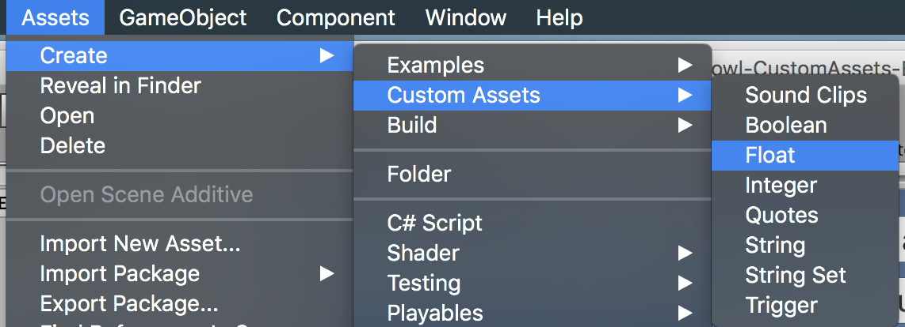

# [Custom Assets](http://www.askowl.net/unity-customassets-package)

## Executive Summary
Custom assets are C# classes that are Unity3D aware so it is a project asset. They hold data set in the Unity Inspector, changed in-game if allowed and written to persistent storage. It also  an event system to alert components on change. The package includes listener MonoBehaviours, both generic and specific. There are granular custom assets around triggers, booleans, integers, floats and strings for decoupling data from game specific code. Sets provide a compelling alternative to enumerations while a dictionary allows access by key. For additional functionality, build your own using the supplied `AudioClips` as a sample.
Every custom asset has a members dictionary to allow for multiple entries keyed on the name. A health asset, for example, may have references to the health for every member of the party.
The custom assets package includes an in-memory pooling system for performance, helpers for working with assets and a basic play mode test framework.

* {:toc}

> Read the code in the Examples Folder and run the Example scene

## Introduction
Unity provides a base class called [ScriptableObject](https://docs.unity3d.com/ScriptReference/ScriptableObject.html). Derive from it to create objects or assets not attached to game objects.

A `ScriptableObject` is a class that contains serialisable data and functionality. Each instance of a class that derives from `ScriptableObject` has representation on disk as an asset. Each asset is a source for data and actions not coupled to a scene. The decoupling makes for functionality easy to test. It also provides modules shared across and between projects.

Custom assets are scriptable objects with benefits.
* A description field to make Unity editor usage easier. The creator can provide more information than just a name on the why and wherefore of an asset.
* All custom assets can have listeners registered against them that get informed of changes in value. In may, new cases components can react to or create changes without additional code.
* Storage can be of anything serialisable - from primitives like float to complex objects, or even MonoBehaviours.
* Custom assets save on program exit and reloaded at startup, providing a clean and straightforward persistence mechanism.
* Basic types offered include Float, Integer, Boolean, Trigger, String and Set.
* Every custom asset has a dictionary of members accessed by name.

### Custom Assets - the new Singleton
Static variables are not evil, just inflexible. Singleton MonoBehaviour instances are not corrupt either. However, both encourage tight coupling between interested parties.

So now for mild blasphemy. Assets created from scriptable objects, and hence custom assets are Unity supported *singletons*. Create `[SerializeField]` fields and drag an asset of the correct type onto them in the editor. All reference to the same in-memory instance.

Using custom assets over traditional singletons provide benefits:

* Code is less coupled - or is that more decoupled?
* Custom assets test in isolation.
* Inject custom assets into objects that are expecting them. An inventory may depend on location or whether the player is in training mode.
* It is less error prone to pass custom assets between scenes and projects.
* Functionality is more generalised for direct reuse from within the editor without writing as much scaffolding code. A `Float` custom asset, for example, can have listeners that hook into display objects. It can also update with sliders and scroll-bars without additional code by adding it to the *On Value Changed* field.
* A custom asset as a singleton to hold game data has one massive failing. There is one copy only. If you want to store player health for an unknown number of players, how do we save it? For this, custom assets have the concept of members. Each named entry holds a reference to the custom asset storage that keyed to member name.

### Custom Assets as Game Managers
Managers are a favourite Unity pattern. And a system-wide master manager, many games have them for player, enemies, sound and more. There are standard features:

* Access by a static `Instance` variable.
* A MonoBehaviour that sets `Instance` in `Awake()`.
* Call `DontDestroyOnLoad(gameObject)` if they are to be common across scenes.
* There is often one manager to rule them all.

It is not uncommon to see code like:

```C#
health = GameManager.Instance.PlayerManager.MaxHealth;
```

Try testing that component in isolation.

A custom asset approach would be more like:

```C#
[SerializeField] PlayerManager;
...
health = PlayerManager.MaxHealth;
```

To work with this version create a test scene and put in an individual PlayerManager custom asset. It might have different data, or it might include mock methods.

### Custom Assets as Configuration
The most common use for scriptable objects is to ignore the scriptable part and use them as configuration containers. A Custom Asset is a file within the project. This file contains a reference to the script and serialised copies of all the data as added in the Unity editor.

You can safeguard the serialisable data by making it a private `[SerializeField]` and using accessors to allow reading, and use them as seed data and change them during program execution.

```C#
class MyData : CustomAsset {
[SerializeField] private int maxHealth;
[SerializeField] private float timeOfDay;

// maxHealth is read-only outside this class
public int MaxHealth { get { return maxHealth; } };
// timeOfDay is read-write
public float TimeOfDay { get { return timeOfDay; } set { timeOfDay = value; } };
```
Later I will introduce better and more granular ways to handle data.

### Read-only Custom Assets
The custom asset inspector allows a designer to mark the asset read-only For serialisable classes as values, protection of internal data is still code bases. Make the fields private and serialisable so that the editor can change them. Then use accessors without `set` to only allow for reading. If you can't trust the code accessing data in a complex object graph, either clone the custom asset or lock down access at all levels.

```C#
var clone = Object.Instantiate(myCustomAsset).Value;
```

Cloning is much more expensive at runtime than baking in protection during the compile phase.

### Custom Assets and Persistence
Custom Assets adds optional persistence to scriptable objects.
Each persistent object serialises to JSON and written as a `PlayerPref` entity. The total storage for an app is about one megabyte. For more massive storage needs, use a database.

The key comprises the name of the asset and the class name, making it unique to the application.

Set persistence from the Unity inspector or code.

```C#
myAsset.Persistence = true;
```

## Accessing Custom Assets

A custom asset is like any other Unity asset. Create a field for it in a MonoBehaviour or other CustomAsset class and drop in the reference.

```C#
public sealed class CustomAssetsExample: MonoBehaviour {
  [SerializeField] private Float             maxFloat;
  [SerializeField] private Float             currentFloat;
  // ...
}
```


Custom assets aid decoupling. Many components can operate without knowing each other.

Access custom asset values by either casting or using the `Value` getter. ToString() will aways call ToString() on the Value field.
```C#
Debug.LogFormat("{0} == {1}",maxFloat.Value, ((float) maxFloat);
Debug.LogFormat("{0} == {1}",maxFloat.Value.ToString(), maxFloat.ToString());
```

### Instance
There is a second way. Use `Instance` to retrieve a reference to any custom asset created or retrieved before.

```C#
Float lifetime = Float.Instance("Lifetime");
UniqueAsset = UniqueAsset.Instance(); // "UniqueAsset" name optional
```

The static Instance method is also useful for in-memory custom "assets". The first call creates a copy while other calls retrieve a reference. You can even keep the value between invocations of the game by setting persistence.

```C#
lifetime.Persistence = true;
```

## Creating Custom Assets
Custom Assets are ScriptableObjects serialised and written to disk as an asset in the project.

```YAML
%YAML 1.1
%TAG !u! tag:unity3d.com,2011:
--- !u!114 &11400000
MonoBehaviour:
  m_ObjectHideFlags: 32
  m_PrefabParentObject: {fileID: 0}
  m_PrefabInternal: {fileID: 0}
  m_GameObject: {fileID: 0}
  m_Enabled: 1
  m_EditorHideFlags: 0
  m_Script: {fileID: 11500000, guid: 22f206729bb7e417e9b12649707e941e, type: 3}
  m_Name: SampleFloatVariable
  m_EditorClassIdentifier: 
  Description: 
  value: 0
  readWrite: 1
  persistent: 0
```
Each custom asset type has an entry on the ***Create / CustomAssets / asset name***. Use it, select the resulting file and fill in the fields. If you want to load it from disk using `Resources.Load(pathFromResources)` you will need to place it in a ***Resources*** folder.

### OfType&lt;T>
`CustomAsset.OfType<T>` is the base type for all custom assets except `Trigger`. Functionality includes being able to register events on change, persistence and some read-only protection.
```C#
[CreateAssetMenu(menuName = "Examples/LargerAssetSample")]
public class LargerAssetSample : CustomAsset.OfType<LargerAssetContents> { }

[Serializable]
  public class LargerAssetContents {
    public int    Order;
    public float  Limit;
    public string Name;
  }
```

All CustomAsset instances include a description field. Since you can use generic assets, it is useful to give others comments on what specific assets represent.

### Primitive Custom Assets
```C#
  [SerializeField] private Float             currentFloat;
  [SerializeField] private Integer           integer;
  [SerializeField] private String            str;
  [SerializeField] private Boolean           boolean;
```
Each if these custom assets can in a project with or without supporting code. It is possible, for example, to have a `Float` value set in the ***On Value Changed*** field of a Slider or Scrollbar, then displayed using listener like `CustomAsset.UIImageFillListener()` to set the fill amount on a health bar,

### Trigger
A trigger is unusual because it has no data apart from event requirements. Triggers do not have persistence, so a subclass containing data will not save.

### Members
A custom asset with any content data also can store and retrieve separate copies by name. For persistent custom assets, the member names and values saved to storage along with the main value.

```C#
[SerializeField] CustomAsset.Integer myInt;
// ...
myInt.Value = 22;
myInt["One"] = 1;
myInt["Two"] = 2;

string[] names = myInt.MemberNames;
Assert.AreEqual(names.Length, 2);

Assert.AreEqual(myInt["One"], 1);
Assert.AreEqual(myInt.ToStringForMember("One"), "1");
Assert.True(myInt.Contains("One"));

myInt.Remove("One");
Assert.False(myInt.Contains("One"));

Assert.True(myInt.Contains("Two"));
myInt.Clear();
Assert.False(myInt.Contains("Two"));
```
`ToStringForMember` requires special mention as it can be use in Inspector event receivers to set values.

### Custom Asset Sets
`Set`, like `OfType` is a generic class. To instantiate it requires the set entries.

```C#
[CreateAssetMenu(menuName = "Examples/SetPicker", fileName = "SetPickerSample")]
public sealed class SetPickerSample : Set<AudioClip> {
  public void Play() { AudioSource.PlayClipAtPoint(clip: Pick(), position: Vector3.zero); }
}
```
This example can play  a sound from the list. This is a great way to make a game sound less tedious.

#### Pick()
All classes inheriting from `Set` have a `Pick()` method with two controlling field entries:
* ***cycle***: True to return entries in order, false to get a random selection.
* ***exhaustiveBelow***: If the number of entries in the set is below this value, then while `Pick()` returns a random entrywith no repeats. From a list of three, nothing appears random.

These options are available in the editor when you create a custom asset from a `Set`.

#### Add(entry)
While in most cases we use the Inspector to fill the `Set`, sometimes we need dynamic changes.
#### Remove(entry)
On occasions, a `Set` entry will expire, and it will be necessary to remove them.
#### Contains(entry)
See if a `Set` contains a specific entry.
#### Count
Retrieve the number of entries in a set.
#### ForEach
Call an action for every entry in a set. If the action returns false, all is complete.
```C#
mySet.ForEach((s) => {return s!="Exit";});
```
#### StringSet
Strings as a set have many usages. `Quotes` implementats `StringSet`.

### AudioClips
Playing one audio clip from a list has been a well-used proof of concept for `ScriptableObject`. Because custom assets, sets and some other toys from this package simplify everything, I am displaying the source here.

```C#
  [CreateAssetMenu(menuName = "Custom Assets/Sound Clips", fileName = "Clips")]
  public sealed class AudioClips : Set<AudioClip> {
    [SerializeField, Header("Audio")]     private Range volume   = new Range(1, 1);
    [SerializeField, RangeBounds(0, 2)]   private Range pitch    = new Range(1, 2);
    [SerializeField, RangeBounds(0, 999)] private Range distance = new Range(1, 999);

    public void Play(AudioSource source) {
      source.clip        = Pick();
      source.pitch       = pitch.Pick();
      source.volume      = volume.Pick();
      source.minDistance = distance.Min;
      source.maxDistance = distance.Max;
      source.Play();
    }
  }
```
`Range` class and `RangeBound` attribute are available in the custom assets package. `AudioClips` will work without them, but sliders are easier to use.

The actor, `Play`, requires an `AudioSource` attached to the game object. It cannot be part of a custom asset.
The Unity framework solves this problem with `UnityEvent`.

```c#
  [SerializeField] private AudioClips audioClips;
  [SerializeField] private UnityEvent audioClipsEvent;
```
will display in the inspector as follows.


The reference to `AudioClips` is optional. It is only there so we can change the fields in the editor without going to the asset.

If you are calling `Play` from code, then you can supply an `AudioSource` or a game object that has an audio source component.

```C#
  [SerializeField] private AudioClips audioClips;
  void Play() { audioClips.Play(gameObject); }
  void Play1() { audioClips.Play(GetComponent<AudioSource>(); }
```

Using `AudioClips` wherever you have sound effects makes your game sound a lot more lively. You could also consider making similar assets for visual effects or animations.

## Editing Custom Assets
Edit Serialised fields in the Unity Inspector just as you would a MonoBehaviour attached to a game object. Unlike a scriptable object, custom assets unload when play mode completes. In this way, they behave more like MonoBehaviours. There is a reason for this madness. In the Unity editor, scriptable objects remain loaded and only reload if the backing code or asset changes on disk. If we don't reset on leaving play mode, changed data from one run lives to the next.

## Custom Assets as Resources
If you can accept the tighter coupling, you can load custom assets my name. It is an alternative to dropping them into referring fields in the Unity inspector. The custom asset must live in a directory under a ***Resources*** path - anywhere in the project.

```C#
// expects /anywhere-in-assets/Resources/Audio/cow-sounds.asset
var moos = Resources.Load<AudioClips>("Audio/cow-sounds");
```

## Custom Assets as Event Sources
The first significant departure from ScriptableObject that CustomAsset provides is the ability to act as an event source.

Primitive custom assets (trigger, boolean, integer, float and string) are easy to use. Drag a reference using the Unity editor into any MonoBehaviour or CustomEvent that needs to access or update them.

Listeners (described below) also need a reference. They register for changing events. The event fires when and only when the custom asset changes.

```C#
  [SerializeField] private Float             currentFloat;
  //Called by button press
  public void UpdateCustomFloat() { currentFloat.Value = currentFloat + 1; }
//...
public sealed class DirectEventListenerSample : CustomAsset.Listener {
  [SerializeField] private Text textComponent;

  public override void OnTriggered() {
    textComponent.text = "Direct Event heard at " + DateTime.Now;
  }
}
```


## Custom Assets as Event Listeners
Life begins now. Writing no code, you can use the prepackaged custom assets and listeners to connect components without them knowing about each other.

Don't believe me? Create a game object inside a canvas and add a slider component.

***Step 1***: Create a Float custom asset from the Unity editor main or context menu.



***Step 2***: Select the custom asset and add any initial data. Make sure it  set read/write.


***Step 3***: Create a new GameObject in the Unity Hierarchy window. Make sure it is inside a Canvas GameObject.


***Step 4***: Go to the inspector for the game object *Slider* and add a slider component.


***Step 5***: Add an *On Value Change* field and drag the Float custom asset into the associated field. Use the function drop-down to select ***Float: Value***.


***Step 6***: Lock the inspector on the Float custom asset and run the scene. Drag the slider and watch the value change in the inspector.


For extra points, we can create a codeless listener.

***Step 7***: Create a UI Button GameObject in a Canvas and change the image type to *Filled*. Note that moving the *Fill Amount* slider causes the button to change background.


***Step 8***: Press the *Add Component* Button then search for and add the *UI Image Fill Listener* component. Set the custom asset to the one created above.


***Step 9***: Run the application and move the slider created above. The button fills and empties.


All concrete listeners must implement `void OnChange(string memberName)`.

A listener has a `ForMember` entry visible in the inspector. If this entry is not empty, then only events sent from matching members pass through. It allows an image fill listener for a health bar to react with a related member.

### Generic Component Listeners
The other end of the Custom Asset event pipeline can be a listener MonoBehaviour. The generic implementations below support functionality for the attached GameObject. Concrete listeners must implement `Change(value)` where *value* is the primitive encapsulated by a base custom asset.

`Change` is member aware. If the event triggers with a member name, it provides the related value for processing.

In the example below, we see a component for changing the text in a UI Text component. It finds one element on the current GameObject of the generic type. `Change()` can then use it to manipulate said item given the new value.

```C#
  public sealed class UITextListener : StringListener<Text> {
    protected override void Change(string value) { Component.text = value; }
  }
```


All component listeners have access to the `Component` and the `CustomAsset` that triggers the action.

```C#
    protected override void Change(float value) { Component.alpha = value; }
      Change((memberName == null) ? (TD) CustomAsset : CustomAsset[memberName]);
```

#### BooleanListener
```C#
  public sealed class AnimatorBooleanListener: BooleanListener<Animator> {
    [SerializeField] private string   parameterName;
    [SerializeField] private Animator animator;

    protected override void Change(bool value) { animator.SetBool(parameterName, value); }
  }
```
#### StringListener
Not that unlike other generic listeners, a string listener will work with any custom asset that implements `ToString()`

#### FloatListener
```C#
  public sealed class UIImageFillListener : FloatListener<Image> {
    protected override void Change(float value) { Component.fillAmount = value; }
  }
```
#### IntegerListener
  public sealed class AnimatorIntegerListener : IntegerListener<Animator> {
    [SerializeField] private string   parameterName;
    [SerializeField] private Animator animator;

    protected override void Change(int value) { animator.SetInteger(parameterName, value); }
  }
### Concrete Component Listeners
The components listed here are part of a growing list of listeners that can used to minimise coupling and reduce project specific code.

#### UI Listeners
##### UICanvasGroupAlphaListener
By adding a canvas group to any GameObject inside a canvas, we can change the transparency (alpha) for all GameObjects inside the hierarchy.

This listener, when added to the same GameObject, monitors a Float custom asset and change the canvas group transparency. I find it useful to fade panels in and out.

##### UIImageFillListener
Images in fill mode make good health and stamina bars. Rather than code them for each requirement in each project, create a Float custom asset. Use this listener to change the fill amount on the upper image. You can even consider making the Float persistent so it does not change if the game restarts.

##### UITextListener
Because it is a `StringListener`, `UITextListener` can accept any custom asset and display the `ToString()` conversion. Just drop it on to any game object that has a Text component, and you can change the value from anywhere.

#### Animation Listeners
Unity has an animation system that includes a state machine and associated animation timelines, packaged with the project as an Animator Controller and Animation assets.

By Referencing an Animator, the code can trigger state changes.


### Unity Event Listeners
The Unity event system is more tightly coupled. Listeners must reference  the element containing an event. With custom assets, the event is a third party that also includes the data that triggered it.

In the following example, we have a UnityEventListener MonoBehaviour that references a Trigger custom access. When the trigger fires it plays the audio source.


## Custom Asset Persistence

If a custom asset is persistent in the Inspector, then it writes itself out to the PlayerPref database using a key combining the name and class.

Persistence occurs `OnDisable` - when the operating system has thrown the game out of memory.

For primitive assets, any updates happen without further coding.

```C#
  Float age;
  age.Value = 32.2f;
```

For custom assets containing a more complicated class or struct, the creator marks changes as part of the update. Creating accessors in the custom asset provides for clearer calling code that using Value - while calling `Set` on the update informs all listeners, but only for read/write assets that have changed.

```C#
[CreateAssetMenu(menuName = "Examples/LargerAssetSample")]
public partial class LargerAssetSample : CustomAsset.OfType<CustomAssetsExample.LargerAssetContents> {
  public int AnInteger { get { return Value.I; } set { Set(ref Value.I, value); } }

  public float AFloat { get { return Value.F; } set { Set(ref Value.F, value); } }

  public string AString { get { return Value.S; } set { Set(ref Value.S, value); } }
}
```

### But What if I'm Different?

Then there are two generic setters for you.

```c#
protected void Set<TF>(ref TF field, TF from);
// and
protected void Set<TF>(ref TF field, TF from, Func<TF, TF, bool> equals);
```

The first used the `object.Equals` method to see if a change has happened. For non-primitives this will check for the same object (at the same address). This may be what you want. More often you will want to compare the members for equality. 

When the custom asset data is not a class of your making, overriding `Equals` may not be suitable. In Unity3d, Quaternion and Vector2/3/4 are classic examples. Quaternion.Equals does an exact comparison and an exact comparison does not play well with floating point due to rounding. Quaternions also override `==` to provide an approximately equals function.

```c#
    protected void Set(ref Quaternion field, Quaternion from) {
      Set(ref field, from, (a, b) => a == b);
    }
```


### Singularities and the Importance of Equals

Many components used to create a custom assets are atomic. This means that while code may need to inspect fields, a update will always be a complete change to the component.

```c#
public struct Location {
    public float latitude;
    public float longitude;
    public float altitude;
    public double timestamp;
}
  [CreateAssetMenu(menuName = "Custom Assets/Location")]
  public sealed class LocationAsset : OfType<Location> {
    public override bool Equals(object other) {
      if (other == null || !(other is Location)) return false;
      Location another = (Location) other;
      return AlmostEqual(Value.latitude, another.latitude) &&
             AlmostEqual(Value.longitude, another.longitude) &&
             AlmostEqual(Value.altitude, another.altitude);
    }
    public float Latitude { get Value.latitude; }
    // etc
  }
```

I have introduced another helper function in `AlmostEqual`, defined as:

```c#
    protected bool AlmostEqual(float  a, float  b) { return Math.Abs(a - b) < 1e-5; }
    protected bool AlmostEqual(double a, double b) { return Math.Abs(a - b) < 1e-5; }
```

It would be better to calculate the distance between the two points and check that.

### Quotes
`Quotes` is a `StringSet` Custom Asset that if given a list of lines and a `TextAsset` returns a line using the `Pick` interface. A quote looks like ***body of the quote (attribution)*** where the attribution is optional. Surround attributions in brackets and place them at the end of the line. RTF is acceptable in the quote.

I would recommend setting ***Exhaustive Below*** to a figure like 50 or 100. Otherwise shorter lists appear to repeat entries too often.

#### RTF
RTF is a static function to convert a string quote into RTF format so that the attribution can be in grey. The text between brackets at the end of the line makes up the attribution.

```C#
Debug.Log(Quotes.RTF("Life wasn't meant to be easy (George Bernard Shaw)"));
```
produces
***"***Life wasn't meant to be easy***"***     *George Bernard Shaw*

### Preview Custom Editor


Unity custom editors provide additional functionality for the Inspector panel. `PreviewEditor&lt;T>` is a generic that adds a ***Preview*** button to the bottom of the Component.

`AudioClipsEditor` is a custom class that plays a sound when pressing ***Preview***.

```C#
  [CustomEditor(typeof(AudioClips))]
  public class AudioClipsEditor : PreviewEditor<AudioSource> {
    protected override void Preview() { ((AudioClips) target).Play(Source); }
  }
```


```C#
GameObject mainCamera = Objects.Find<GameObject>("Main Camera");
```

Often the object is unique and named after it's underlying class.

```C#
setPickerSample = Objects.Find<SetPickerSample>();
```

`Find` is resource hungry. Only use it in called methods like `Awake`, `Start` or `OnEnable`. It is never necessary for production code but is an excellent helper with play mode tests. 

