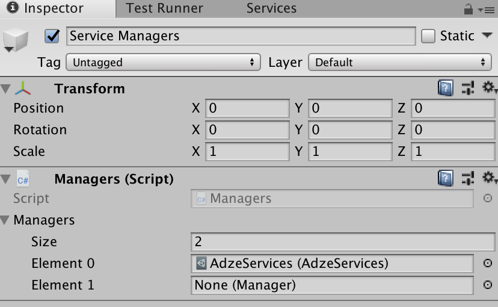
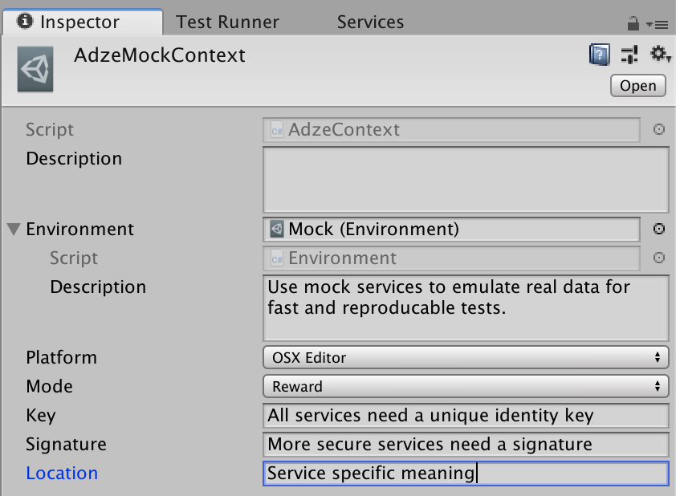
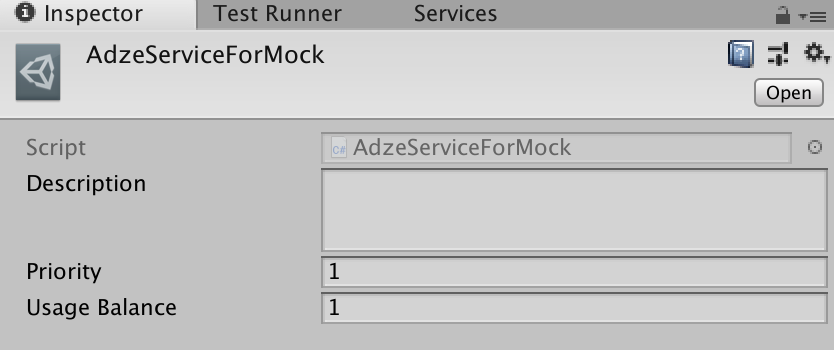
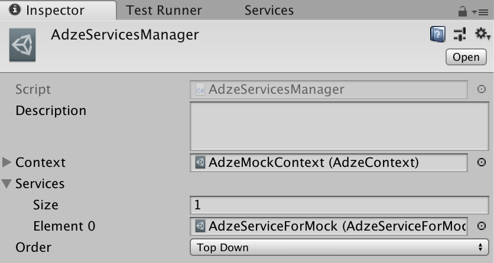
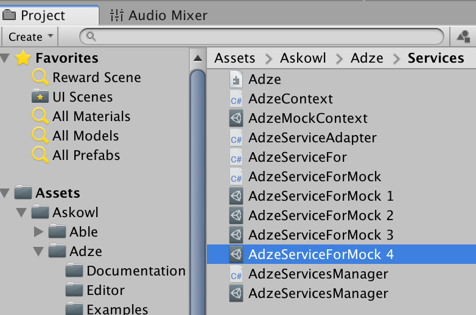
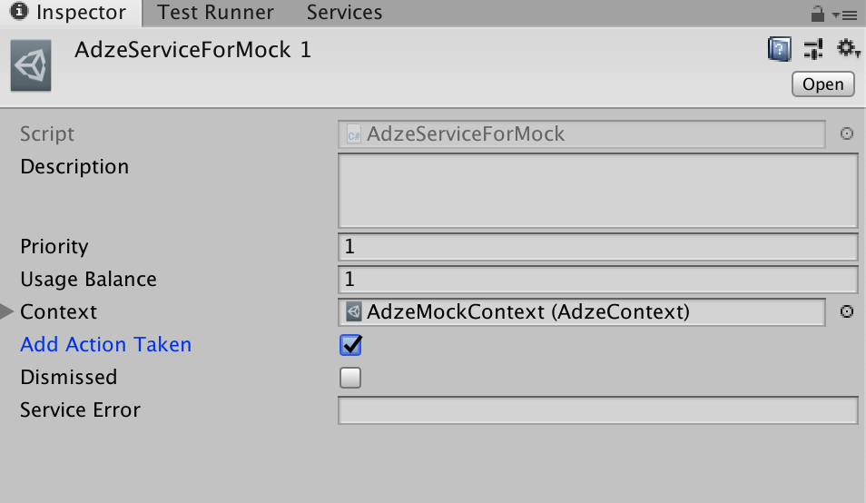

* Table of Contents
{:toc}

> The Doxygen pages are [here](https://paulmarrington.github.io/Unity-Documentation/Decoupler/Doxygen/html/annotated.html)

# [Executive Summary](http://www.askowl.net/unity-decoupler)

The Askowl Decoupler is here to provide an interface between your code and Unity packages. Take analytics packages as an example. There are dozens of them. With Askowl Decoupler you can switch between them depending on which you have installed. You can also choose at platform build time. Not all analytics packages support XBox or Web apps. The same logic works for databases, social networks, authentication and many others.

> Read the code in the Examples Folder.

# Introduction

Decoupling software components and systems have been a focus for many decades. In the 80s we talked about software black boxes. You didn't care what was inside, just on the inputs and outputs.

Microsoft had much fun in the 90's designing and implementing COM and DCOM. I still think of this as the high point in design for supporting decoupled interfaces.

Now we have Web APIs, REST or SOAP interfaces and micro-services. Design patterns such as the Factory Pattern are here to "force" decoupling at the enterprise software level. There have been dozens of standards over the years.

Despite this, programmers have continued to create tightly coupled systems even while enforcing the requirements of the framework.

Consider a simple example. I have an app that uses a Google Maps API to translate coordinates into a description "Five miles south-west of Gundagai". My app is running on an iPhone calling into a cloud of Google servers. The hardware is different and remote, and they both use completely different software systems. However, my app won't run, or at least perform correctly, without Google. Worse still if I am using a Google library, it won't even compile without a copy.

# What is the Askowl Decoupler
First and foremost, the Askowl Decoupler is a way to decouple your app from packages in the Unity3D ecosystem.

It works at the C# class level, meaning that it does not provide the physical separation. That is done by the Unity packages when needed. In approach, it acts very much like a C# Interface.

# What does the Askowl Decoupler give me?
1. You can build and test your app while waiting for supporting Unity packages to be complete.
2. You can choose between unity packages without changing your app code. Changing from Google Analytics to Unity Analytics to Fabric is as simple as getting or writing the connector code.
3. You can provide a standard interface to a related area. For social media, the interface could support FaceBook, Twitter, Youtube and others. You could then send a command to one, some or all of them. Think of this regarding posting to multiple platforms.
4. You can have more than one service then cycle through them or select one at random. For advertising, you can move to a new platform if the current one cannot serve you an ad.
5. Mocking is merely another decoupled package, albeit the first one you will write.

# Decoupling Packages

## How do I use a decoupled package?
Always get an instance through static methods on the interface.

### For singleton services
Access the registered service using the Instance selector. If keeping a reference, set it in Awake or later. It gives the services an opportunity to register.
```c#
Decoupled.Authentication auth;
void Awake() { auth = Decoupled.Authentication.Instance; }
```

### To cycle through a list of services
Access the next registered service using the Instance selector.
```c#
        Adze.Server server = Adze.Server.Instance;
        int cycleIndex = server.CycleIndex;
        do {
          yield return server.Show(currentMode);
          if  (server.error) break;
          server = Adze.Server.Instance;
        } while (server.CycleIndex != cycleIndex);
```
In the example, the code will cycle through all the advertising services, stopping when one display an ad or when the list has been exhausted.

### To select a named service
All services have a name. Names are set by either specifying the name in `Register`/`Load` or using the default name is the class name of the service. A service can then be retrieved by name using `Named`.

```c#
[RuntimeInitializeOnLoadMethod(RuntimeInitializeLoadType.BeforeSceneLoad)]
    private static void RegisterService() { Social.Register <Facebook>(); }

```

```c#
  Decoupled.Social facebook = Decoupled.Social.Named("Facebook");
```

### Send to All Services
Another type of service is to have multiple instances, and we need to do something with all of them. It could be anything from display a list of names for user selection or call a method on some or all of them. `Social` is one of these where we may be connected to multiple social networks and send a message to some.

```c#
for (int i = 0; i < Decoupled.Service.InstanceList.Count; i++) {
  Decoupled.Service.InstanceList[i].Send(myMessage);
}
```

### To choose a service randomly
`Random()` and `Exhaustive()` are static methods on the interface. Random selection can cause a perceived imbalance with short lists. Exhaustive is also a random picker, but it ensures all choices are exhausted before starting again.

```c#
  Decoupled.Social.Random();
  Decoupled.Social.Exhaustive();
```

### How do I know if there is a service implemented
All service interfaces have a static member `Available`.

```c#
  if (!Decoupled.Social.Available) Debug.Log("Oops");
```

## How much work do I need to do to implement a decoupler?
### For an already written decoupled package
#### If it comes with a controller or *prefab*
1. Create an empty gameObject in the first scene of your game
2. Drag the controller code or *prefab* to the gameObject
3. Fill any requirements in the controller from the Unity editor
4. Run the app. The decoupled package replaces the default placeholder

#### If it has an initialiser in an Editor directory
There is nothing more to do.

In either case, if external dependencies are needed, the log provides what is needed.

### For a new package and an existing interface
1. Create a new project
2. Import any unity packages required
4. Create an API where the base class is the interface
5. Implement the virtual methods as needed (using override)
6. Create a loader method to register this service

A sample service would look something like this.
```c#
#if AnalyticsFabric
  public sealed class AnalyticsFabric: Analytics {
    public override void Event(string name){/* etc etc */}
    [RuntimeInitializeOnLoadMethod(RuntimeInitializeLoadType.BeforeSceneLoad)]
    private static void RegisterService() { Analytics.Register<AnalyticsFabric>(); }
  }
#endif
```
By using ***Askowl.DefineBuild** set a definition file in an ***Editor*** directory. Here we are deciding on the existence of a package by the existence or not of a directory.

```c#
  [InitializeOnLoad]
  public sealed class DetectMyUnityPackage : DefineSymbols {
    static DetectMyUnityPackage() {
      bool usable = HasFolder("Fabric");
      AddOrRemoveDefines(addDefines: usable, named: "AnalyticsFabric");
    }
  }
}
```

### For a new interface
The decoupler interface is not an Interface in the Java/C# sense. It is a base class. It provides decoupling support as well as default functionality.

If the decoupler interface is for a new package you are writing, then the methods are a matter for software design. If it is an existing package, then the contents reflect the functionality you want to access. It can be just the parts you need or if for distribution, it may be exhaustive. For an example of the latter, look at ***Askowl-Decoupler/Services/Analytics***. There are multiple classes here to represent different aspects of the analytics requirement.

```c#
namespace Decoupled.Analytics {
  public class Play : Decoupled.Service<Play> {

    public virtual void Screen(string name, string clazz) {
      Debug.Log("**** Screen '" + name + "' - " + clazz);
    }
  // ...more
}
```

Most interface methods do nothing. Since analytics is a form of logging, it is best to display to the console by default. In our production code, we may override the interface with Firebase Analytics for Android and iOS, but falling back to the default for the Editor. We might even choose a different analytics system for OS X, Windows or Windows Phone.

Often when the interface is for remote services, results are asynchronous.

```c#
namespace Decoupled {
  public class Authentication: Decoupled.Service<Authentication> {

    public class User {
      public string Name = "guest";
      public string Email = "";
      public string PhotoUrl = "";
      public string PhoneNumber = "";
      public string ProviderId = "";
      public string UserId = "";
      public bool IsVerified = false;
      public bool IsLoggedIn = false;
      public object MetaData = null;
    }

    public User user = new User ();

    public virtual IEnumerator CreateUser(string email, string password, Action<string> error = null) {
      user.Name = user.Email = email;
      yield return null;
    }
  // ... more
}
```

In a service that talks to a server, the yield waits for a response. This example also shows an inner data class. Each application has to fill it from server supplied data.

It may seem like much work, but it is quite simple. Writing an interface is a matter of learning what is available and deciding what is required.

## Mocking
Another advantage of decoupling interfaces is the ability to add mocked services. Often services are unavailable or have restrictions on pre-production use. As an example, I mock the GPS service so that I can test in the Unity editor. I also mock authorisation, authentication and social media services.

Also, partial mocking has value. I can subclass a database driver to make sure that they use test tables or documents.

If a service implementation calls `RegisterAsMock` instead of `Register`, then this service locks itself in as the provider. Decoupler provides a generic `Mock` MonoBehaviour that allows you to turn mocking on and off from the inspector. It registeres the service in `Awake()`. There is a template in Decoupler/Mock.

``` c#
  public class MockTemplate : Mock<MockTemplate.Service> {
    // Data that can be changed in the inspector to effect mock results
    [SerializeField] private string templateData;

    public class Service : TemplateService { =
      /* mock implementations of service methods */
    }
  }

  public class TemplateService : Service<TemplateService> {
    /* abstract or default service methods */
  }
```

There is always a risk of mocks leaking to production. Decoupler mocks write a warning to the log, so as long as you insist on a clean log before release, all is well.


## Built-In Interfaces

To use a decoupled service, you need to have an interface class. Often these are provided with packages that need them, but for commonly needed ones, we have included them in Askowl Decoupler.

* [Analytics](http://analytics.marrington.net)
* [Authentication](http://authentication.marrington.net)
* [Database](http://database.marrington.net)
* [DynamicLinks](http://dynamicLinks.marrington.net)
* [Invites](http://invites.marrington.net)
* [Messaging](http://messaging.marrington.net)
* [RemoteConfig](http://remoteConfig.marrington.net)
* [Social](http://social.marrington.net)
* [Storage](http://storage.marrington.net)

# Decoupling Components

Decoupling means providing a familiar code interface to components of similar functionality. Two examples that come to mind are UI Text components and Cameras.

## How do I use decoupled components?
Drag the decoupled component into the inspector for your game object. The decoupler is bright enough to work out and load the component it needs. When you have a choice, load a component first, and the decoupler uses it. If the decoupler already exists, select *Reset* to have it pick up and changes.


In this example, the *TextMesh Pro* package exists. The decoupler recognises it and adds the correct component when ***Textual*** is loaded or reset. If I wanted to use the built-in UI Text component instead, I could have added it first or removed the TextMesh Pro and added the UI Text component. ***Textual*** won't override your choice.

To change the text content, use the Textual component decouples your code from the underlying implementation.

```c#
Textual messages;
void OnEnable() { messages = GetComponent<Textual>(); }
void ChangeMessage(string newMsg) { messages.text = newMsg; }
```

## Creating Decoupled Components
Given a choice between two systems, you need to create four classes - one for the interface, one for each of the systems and one to tell the editor which to load.

The class to create a compiler definition needs to be in an Editor folder. With this set we can compile without errors since any code since any code requiring an optional package can be commented out with `#define`.

```c#
  [InitializeOnLoad]
  public class TextMeshProDefinition : DefineSymbols {
    static TextMeshProDefinition() {
      bool loaded = HasFolder("TextMesh Pro") || HasPackage("com.unity.textmeshpro");
      AddOrRemoveDefines(addDefines: loaded, named: "TextMeshPro");
    }
  }
```

Now we can create the interface as a partial class.

```c#
  internal interface TextualInterface {
    string text { get; set; }
  }
  public partial class Textual : ComponentDecoupler<Textual>, TextualInterface {
    private TextualInterface Backer => Instance as TextualInterface;
    public string text { get => Backer.text; set => Backer.text = value; }
  }
```
Let's deconstruct this.
* First we create an interface for all the properties and methods we want to expose.
* Next we add a class with a basic or mocked implementation of the interface.
* In this class we add a property, `Backer`,  for retrieving an instance of the interface from the underlying generic data reference.
* Lastly we need to place all the properties and methods onto the outer class for seamless use. The interface enforces this.

The second class is the default component. It should either be a stub or a native component that comes with Unity.

```c#
  public partial class Textual {
    private class UnityTextInterface : ComponentInterface, TextualInterface {
      private Text UnityText => Component as Text;

      public string text { get => UnityText.text; set => UnityText.text = value; }

      public UnityTextInterface() => Instantiate<Text>(primary: false);
    }
    private UnityTextInterface unityTextInterface = new UnityTextInterface();
  }
```

We could have placed this in the first partial, but it is cleaner separated. Now we can replicate this for another component.

```c#
    private class TextMeshProUguiInterface : ComponentInterface, TextualInterface {
      private TextMeshProUGUI TmpText => Component as TextMeshProUGUI;

      public string text { get => TmpText.text; set => TmpText.text = value; }

      public TextMeshProUguiInterface() =>
          Instantiate<TextMeshProUGUI>(primary: true);
    }

#if UNITY_EDITOR
    [InitializeOnLoadMethod]
#endif
    [RuntimeInitializeOnLoadMethod]
    private static void TextMeshProUguiInitialise() {
      Instantiate<TextMeshProUguiInterface, TextMeshProUGUI>(primary: true);
    }
  }
```

This time the code only exists if we have defined the variable ***TextMeshPro***. Since we know we want to use this component if it is available, we use the primary parameter. When you drop ***Textual*** into your game object you also get a TextMeshProGUI component.

What happens when you don't have TextMesh Pro installed? When you attach a ***Textual*** component, it won't find a compatible concrete component, so it uses what it can file - `Text`.

## Built-In Interfaces

### Place-holders

I will document the interfaces once an implementation is released.

1. ***Authentication*** - with Facebook, Google, etc
2. ***Database*** - cloud-based service
3. ***DynamicLinks*** - Cloud hyperlinking
4. ***Invites*** - Invite others to your team/game
5. ***Messaging*** - send and receive messages
6. ***RemoteConfig*** - update configuration without a reinstall
7. ***Social*** - for Facebook, Twitter, Google+, etc

### Textual

Add the component `Textual` to the inspector for your game object. It loads the Unity Text object unless you have installed the TextMesh Pro package.

```c#
Textual helpText;
void OnEnable() { helpText = GetComponent<Textual>(); }
void ShowHelp(string txt) { helpText.text = txt; }
```

# From CustomAsset Move

### Decoupling Services
A game that connects directly to external services is brittle. Custom Asset Services decouples your game from external services. It makes changing service providers easier. Multiple providers, fallback on failure amd mocking are all supported. Using different providers for different platforms is as easy as creating a new context asset. A database service, for example can have different contexts for production, staging, test and development.

## Services

Decoupling software components and systems have been a focus for many decades. In the 80s we talked about software black boxes. You didn't care what was inside, just on the inputs and outputs.

Microsoft had much fun in the 90's designing and implementing COM and DCOM. I still think of this as the high point in design for supporting decoupled interfaces.

Now we have Web APIs, REST or SOAP interfaces and micro-services. Design patterns such as the Factory Pattern are here to "force" decoupling at the enterprise software level. There have been dozens of standards over the years.

Despite this, programmers have continued to create tightly coupled systems even while enforcing the requirements of the framework.

Consider a simple example. I have an app that uses a Google Maps API to translate coordinates into a description "Five miles south-west of Gundagai". My app is running on an iPhone calling into a cloud of Google servers. The hardware is different and remote, and they both use completely different software systems. However, my app won't run, or at least perform correctly, without Google. Worse still if I am using a Google library, it won't even compile without a copy.

A service custom asset provides a way to decouple your app from packages in the Unity3D ecosystem. It works at the C# class level, meaning that it does not provide the physical separation. That is provided by the Unity packages when needed. In approach, it acts very much like a C# Interface. So, what does it give us?

1. You can build and test your app while waiting for supporting Unity packages to be complete.
2. You can choose between unity packages without changing your app code. Changing from Google Analytics to Unity Analytics to Fabric is as simple as getting or writing the connector code.
3. You can provide a standard interface to a related area. For social media, the interface could support FaceBook, Twitter, Youtube and others. You could then send a command to one, some or all of them. Think of this regarding posting to multiple platforms.
4. You can have more than one service then cycle through them or select one at random. You can try another advertising provider if the current one cannot serve you an ad.
5. Platforms such as iOS, Android, Mac, Steam, Windows, etc can used different underlying services without code changes.
6. Mocking is not only possible, but flexible and easy to implement.

Now I could write some twisted documentation that I feel would be confusing. Instead I present a real-world example for an advertising service manager.

### Adze: A Sample Service
* Creating a new service is easy. Just select the Assets or Project context menu ***Create // Custom Assets // Services // Create Service***
* You will be asked to give a name to your service. Make the name descriptive. Your service will be created in a directory of the same name. Rename or move it as you wish.
* Your scene is updated with a ***Service Managers*** game object with a Managers component adding your service manager.




* If the service directory isn't under a scripts directory you will need to add an assembly definition (Assets or Project context menu ***Create // Assembly Definition***)
* Here I have renamed the ***Adze*** directory to ***Scripts*** and created an assembly definition file
* There are four C# source files generated and three services.


* Let's look at the source files first. They are all named starting with the name you gave your service.
  * The `Context` file requires editing. It is used to compare every service against the current context. Every context asset has an environment. `Production`, `Staging`, `Test` and `Mock` are provided as custom asset Enumerations, but you can add more. Adze, as seen here, filters services on running platform and advertisement type. The context will also hold data to be sent to the underlying services.

```c#
  [CreateAssetMenu(menuName = "Custom Assets/Services/Adze/Context", fileName = "AdzeContext")]
  public class AdzeContext : Services<AdzeService, AdzeContext>.Context {

    #region Context Equality
    public enum Mode { Banner, Interstitial, Reward }
    [SerializeField] public RuntimePlatform platform = default;
    [SerializeField] public Mode mode = Mode.Reward;
    #endregion

    #region Connection Data
    [SerializeField] public string key = default;
    [SerializeField] public string signature = default;
    [SerializeField] public string location = default;
    #endregion

    protected bool Equals(AdzeContext other) =>
      base.Equals(other) && Equals(platform, other.platform) && Equals(mode, other.mode);
  }
```

  * The next file requiring attention is the `ServiceAdapter`. It provides some helpers.
    * `Prepare()` in case we have to boot the external service provider.
    * `GetAnEmitter()` that all the asynchronous services will return so that the calling code can wait on a result.
    * `Error(message)` when something unfortunate happens.
    * `Log(action, message)` to record interesting information for analytics.
    * `LogOnResponse()` is called when the emitter is fired.

   Many service adapters are just a list of interface methods to implement in concrete services. Sometimes, like here, an interface can be massaged for concrete service differences.

``` c#
  [CreateAssetMenu(menuName = "Custom Assets/Services/Adze/Service", fileName = "AdzeServiceAdapter")]
  public class AdzeServiceAdapter : Services<AdzeServiceAdapter, AdzeContext>.ServiceAdapter {
    [Serializable] public class Result {
      public bool AdActionTaken;
      public bool Dismissed;
      public string ServiceError;

      internal static Result Instance(Emitter emitter) =>
        Result<Result>(emitter);

      internal Result Clear() {
        AdActionTaken = Dismissed = default;
        ServiceError  = default;
        return this;
      }
    }

    protected override void Prepare() { }

    // Registered with Emitter to provide common logging
    protected override void LogOnResponse(Emitter emitter) {
      var result = Result.Instance(emitter);
      if (result.ServiceError != default) {
        if (!string.IsNullOrEmpty(result.ServiceError)) Error($"Service Error: {result.ServiceError}");
      } else if (result.Dismissed) {
        Log("Dismissed", "By Player");
      } else {
        Log("Action", result.AdActionTaken ? "Taken" : "Not Taken");
      }
    }

    public Emitter Show() {
      Log(action: "Show", message: "Now");
      var emitter = GetAnEmitter<Result>();
      var result  = Result.Instance(emitter).Clear();
      Display(emitter);
      return result.ServiceError == default ? emitter : null;
    }

    protected virtual string Display(Emitter emitter) => 
      throw new NotImplementedException();
  }
```

  * `AdzeServiceFor` is a bare framework class to be duplicated for each `real` service. I suggest copying the concrete service interface functions into it so it is ready for processing each time it is duplicated.

``` c#
  [CreateAssetMenu(menuName = "Custom Assets/Services/Adze/ServiceFor", fileName = "AdzeServiceFor")]
  public abstract class AdzeServiceFor : AdzeServiceAdapter {
    protected override void Prepare() => base.Prepare();
    
    protected override void LogOnResponse(Emitter emitter) => 
      base.LogOnResponse(emitter);

    protected override string Display(Emitter emitter) =>
      throw new NotImplementedException();
  }
```

  * The first concrete service implementation is `ServiceForMock`. Create the simplest possible version that will work at this stage. We would want to check on what happens on conditions such as a service error. We will leave hefty mocking to the next section.

``` c#
  [CreateAssetMenu(menuName = "Custom Assets/Services/Template/Service", fileName = "TemplateSelector")]
  public class AdzeServiceAdapterForMock : AdzeServiceAdapter {
    protected override string Display(Emitter emitter, Result result) {
      Log("Mocking", "Display Advertisement");
      result.ServiceError = default;
      result.Dismissed = false;
      result.AdActionTaken = true;
      emitter.Fire();
    }
  }
```

  * The final file created is `ServicesManager` does not require editing. It selects services from the list that match a global context. More on that later.

* The helper also creates three asset files.
  * `MockContext` is the context you will want to use when you don't want to annoy a real service. It is used for development, particularly of edge cases, and to reproduce problems (bugs) when they arise. It is also used to test other components that need the service in a reliable and usable way.  By default it will only work in the mock environment, under the Unity editor and in reward mode. There is more on mocking in the next section.



  * Using `ServiceForMock` is covered in detail below.



  * All concrete services, however, do have some information to review.
    * ***Priority*** provides simple ordering. Once the list of services has been filtered, it is sorted by priority. This only affects top-down and round-robin service selection. If a service fails, the next on the list is attempted.
    * ***Usage Balance*** defines how many repeat calls on a service are made before a new selection is used. It does not benefit top-down selection. In Adze, for example, we can use it to ensure that twice as many advertisements come from ChartBoost as from AdMob.
  * `ServiceManager` is where we reference all the services and provide a context to decide which to use. At this level the context is mostly about the target build - as in mock, development, test, staging or production. Thanks to service masking you can drop every service you create into the list, whether it is for a specific platform or type of service. ***Order*** is interesting. Services are filtered to match the context provided then presented as a list based on their priority (as set in each service asset). If they are all the same priority the element order here counts. Values for order are:
    * ***Top Down*** where the first service is always used. If it fails the next one is used, and so on until a service succeeds. Next call starts with the first again. Most services with more than one entry will work this way.
    * ***Round Robin*** starts with the first service. It is run once, then again ***Usage Balance*** number of times. Then the next viable service is called. When all have had a turn the first is called again. Useful for advertising where we want to spread our ads over multiple providers.
    * ***Random*** does as it says. Once ***Usage Balance*** is depleted it will select another entry at random.
    * ***Random Exhaustive*** does the same, except no service is selected more than once until all the other services have had a go.



### Service Masking

Mocking is all very well but real services will have libraries that talk to the outside world. And those libraries won't even load on all platforms. This is not a show-stopper because Able provides tools that make it easy to set C# compiler definitions that we can use to exclude code we can't use.

Look at `DetectService()` at the end of the template service adapter class. `InitializeOnLoadMethod` ensures that it is only run in the editor. It's only job is to see if a service package is available, and if it is create a c# compile-time symbol.

``` c#
[InitializeOnLoadMethod] private static void DetectService() {
  bool usable = DefineSymbols.HasFolder("Chartboost");
  DefineSymbols.AddOrRemoveDefines(addDefines: usable, named: "AdzeServiceForChartboost");
}
```

For focus and brevity reasons the service adapter excluded the masking code that comes as standard. Here is the full monty.

``` c#
using Askowl;
using UnityEditor;
using UnityEngine;
#if TemplateServiceFor
// Add using statements for service library here
#endif

[CreateAssetMenu(menuName = "Custom Assets/Services/Template/Service", fileName = "TemplateServiceFor")]
public abstract class TemplateServiceFor : TemplateServiceAdapter {
  #if TemplateServiceFor
  protected override void Prepare() => base.Prepare();

  protected override void LogOnResponse(Emitter emitter) => base.LogOnResponse(emitter);

  // Implement all interface methods that call concrete service adapters need to implement
  protected override void TemplateServiceMethod(Emitter emitter, TemplateServiceMethodResult result) {
    // Access the external service here. Save and call emitter.Fire when service call completes
    // or set result.ErrorMessage if the service call fails to initialise
  }
  #endif
}
```

Your Tasks are:

1. Edit `ServiceAdapter`
   1. The first task is to replace `TemplateServiceFor` with a unique service specific symbol. For Adze it could be `AdzeServiceForChartBoost`.
   2. Tell `DetectService()` whether to add or remove the compiler symbol. If the external service is using the Unity package manager, use `HasPackage`. Otherwise, hopefully, you can sense the presence base on the existence of a folder inside ***Assets***.
   3. Fill in the `Result` class with any common result data.
   4. Fill in what you can in support and general fields and methods. More will come to mind later when writing the concrete services.
   5. For each service method copy the three entities in `TemplateServiceMethod` and rename it to describe the service.
2. For each concrete service, duplicate the `ServiceFor` file and;
   2. Add a reference to the external service library in the fenced off area at the top of the file.
   3. Implement all the interface methods. Note that they are protected by a precompiler `#if` statement so they can make calls to to the external library safely.
   4. Use the information in `context`. Specifically don't access production issues unless `context.environment` is set to Production.

### Service Mocking
The service builder has generated a mock service for you. We filled it with very basic positive response above. It also generated one mocking service custom asset. This is often enough for most services. Not so for Adze. Advertising services are not critical and are more likely to fail. Duplicate this asset three time since they will all use the same code reference.



Let's move on to the source. Fortunately we encapsulated all the communications information in the `Result` and pass a reference to our concrete method. Further more, the data indicates behaviour driven testing. See the Adze documentation for the full Gherkin executable documentation. We will only do a subset here.

``` gherkin
@CustomAsset
Feature: Adze
  Adze provides a decoupled layer to external advertising services.

  Rule: First passing service will respond to a display request repeatedly
  
    Background:
      Given 4 services available
      And they are ordered  as "Round Robin"
      
    Example: The first service responds
      Given that all services work
      When I ask for an advertisement
      Then I get the first service
      When I ask for an advertisement again
      Then I get the second service
      
    #... Examples to cover all the other combinations
```

Before we can write the step definitions we are going to need to make necessary data available.

* Add `[SerializedField] public Result results` to the mock concrete service; plus
* Fill the result object passed to the service method with that set in the Inspector; and we get

``` c#
  [CreateAssetMenu(menuName = "Custom Assets/Services/Adze/ServiceForMock", fileName = "AdzeServiceForMock")]
  public class AdzeServiceForMock : AdzeServiceAdapter {
    [SerializeField] public Result mockResult;
    [SerializeField] private float secondsDelay = 0.1f;

    protected override string Display(Emitter emitter, Result result) {
      Log("Mocking", "Display Advertisement");
      result.dismissed     = mockResult.dismissed;
      result.adActionTaken = mockResult.adActionTaken;
      result.serviceError  = mockResult.serviceError;
      Fiber.Start.WaitFor(secondsDelay).Fire(emitter);
      return default;
    }
    public override bool IsExternalServiceAvailable() => true;
  }
```


Let's see if we have all we need for the step definitions.

* Providing there are more than we need we can truncate `ServiceManager.selector.Choices`.
* set `ServiceManager.selector.Choices[0].serviceError = default` to mark as passed OK.
* `ServiceManager.selector.CycleIndex` should be 0 after each run.

For more detail, go to ***Askowl BDD*** for information on writing and running Gherkin executable specifications and ***Askowl Adze*** for the full feature specifications and definitions for Adze.
