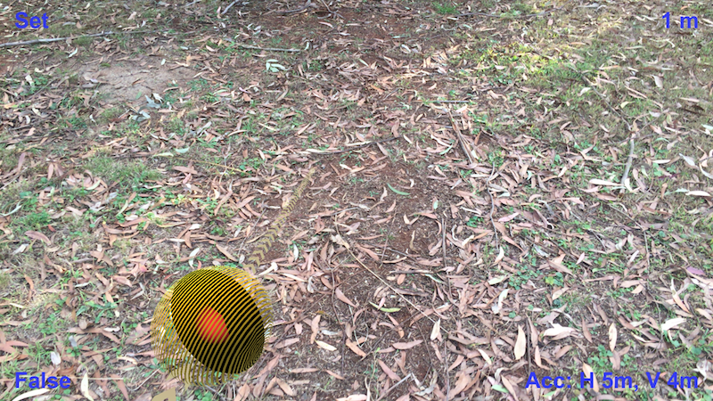

* Table of Contents
{:toc}
# [Executive Summary](http://unitydoc.marrington.net/Mars)

Unity provides access to native components on Android and Apple phones. For markerless augmented reality, we need to use the camera, GPS, gyroscope and compass modules. ***Mars*** integrates these components while decoupling the interfaces to provide for hardware variations.

When a gamer moves the phone around, we need it to match the Unity scene. So, when the gamer looks down, the real-world ground is visible where the Unity objects do not cover it. As the phone is used to look around, Unity game objects are visible relative to the viewer in the locations and distances created in the game.

Secondly, ***Mars*** uses the GPS, compass and gyroscope to provide location and direction for the player. In this way, game objects appear at real-world coordinates, and the player can turn towards them. They become larger as the player approaches.

Since the hardware does not indicate obstacles, this approach works best on open ground. The next step would be to include data from Google Maps and the camera to guess at the location of the building and similar more massive objects.

For the record ***Mars*** is an acronym for *Markerless Augmented Reality System*.

# Sample Project
Seeing helps with understanding. Load the ***Mars*** project into Unity3D and open the *Examples/Editor/Sample* project. Let's go through the hierarchy.

## Mocks

The *Mocks* game object should be disabled. You can enable it for testing in the Unity editor. Run the application then switch back to the *Scene* view and watch the chevrons and ball movement. Currently, only the GPS has a mock. Don't forget to disable mocking again before installing the application on the phone.

## 3D Canvas

The *3D Canvas* with it's associated *GeoPointer.cs* script live in the *Examples* directory. They provide a platform for you to write your system.

### Compass

A green cross is on the ground below the player's feet with one leg marked North. The compass represents all the player-centric elements in your Unity scene. The games objects move with the player. A glowing sphere can be one metre from the player. It is to the north of the player. It is alway north of the player no matter which way the camera is pointing.


#### Chevrons

For convenience, the *Chevrons* game object is inside the compass. It rotates around the same location as the compass but points to the target. Follow the yellow brick road.


The *GeoPointer.cs* does a little work. Whenever the application detects that the player (or target) have moved, it needs to update the chevron path to point in the correct real-world direction.

```c#
      var here  = gps.Here;
      var there = gps.Location(target);
      float bearing = (float) Geodetic.BearingDegrees(here, there);

      chevrons.transform.localRotation =
          Tetrad.Do(chevrons.transform.localRotation)
            .AngleAxis(Trig.zAxis, -bearing).Quaternion;
```

### Target

The *chevrons* point to a target represented by a small ball here. The target grows larger as you get closer to it.


It requires a little more work than changing the direction of the chevrons since we need to account for the distance to correctly size the game object.

```c#
      var here  = gps.Here;
      var there = gps.Location(target);
      float bearing = (float) Geodetic.BearingDegrees(here, there);
      var distanceApart = WorldKmToUnityUnits(
          Geodetic.Kilometres(here, there));
      bearing = (float) Trig.ToRadians(bearing);

      Vector2 position = Trig.Relative(distanceApart, bearing);
      atTarget.position = new Vector3(
          position.x, atTarget.position.y, position.y);
```

The field `WorldKmToUnityUnits` is scene specific. You need to work out what one metre in the game world is. One to one is neat, but for no good reason, the sample scene is about 80 games units to the metre. Adjust in the *Inspector* window for the *3D Canvas* game object that contains a reference to the *GeoPointer.cs* script. In a real game, it can probably be hard coded.



## AR - Full Screen

***Mars*** provides a *prefab* to drive most of the device integration needed to make the AR magic happen. The prefab is driven by *DeviceCameraComponent.cs*. It decides on camera direction and placement within the scene using information gathered from the gyroscope, magnetometer and GPS.

### Unity Camera Container / Main AR Camera

Because *Main AR Camera* has the tag *MainCamera* it takes precedence over the original main camera when the application runs. Because the *Main AR Camera* follows the player, *DeviceCameraComponent.cs* only needs to rotate it to match directions with the phone.

### Background Camera

The image from the webcam is projected from this camera and always pointing in the direction the player/webcam is looking.

### Camera Canvas / Background

Think of this canvas as an old-time projection screen. We are going to project it with the real-time images sent from the webcam. Since it is always in front of the user no matter which way they turn, they see the camera image as the phone does.

### UI Canvas

The *UI Canvas* is an overlay on the Camera canvas. Think on shadow puppets on a screen. Anything on this canvas will partially or fully obscure the webcam image. Since canvas is a 2D game object, this canvas is for text and buttons. It already contains a *String* and a *Trigger* custom asset for each corner.

```c#
      Listener.Instance(topLeftButton, SetGpsTarget);
...
      bottomLeft.Text = gps.Device.Location.ToString();
...
      private void SetGpsTarget() {
        if (gps.Ready) SetGpsTarget(gps.Device.Location);
      }
```

The custom assets are available in *Assets/Askowl/Mars/Assets/Interactives*.

# Decoupled Interfaces

Unity provides built-in support for the necessary AR devices for iOS and Android. ***Mars*** uses the Askowl Decoupler to separate interface from implementation. In this way, you could, in theory, use third-party drivers for VR and XR equipment with cameras.

There are three essential directories.

1. *Assets/Askowl/Decoupler/Services/IoT* for the interfaces
2. *Assets/Askowl/Mars/Assets/Hardware* for the included implementations
3. *Assets/Askowl/CustomAssets/Scripts/Mutable/IoT* for the CustomAsset scripts

Applications work with custom assets rather than directly with services.

## Compass

### Service

```c#
[SerializeField, Tooltip("Not too small or there will be jitter")]
private float minimumChange = 0.2f;
/// Turn on compass if required
void Initialise();
/// Set if compass failed to initialise
bool Offline;
/// Accuracy of compass at the moment (in degrees)
float AccuracyDegrees;
/// Which way the phone is pointing relative to magnetic north
float MagneticHeading; //  (in degrees)
/// Epoch time (seconds between 1/1/1970) since last reading
double TimeStamp;
/// Which way the phone is pointing relative to geographic north
float TrueHeading; // (in degrees)
/// Sets or retrieves the enabled status of this device.
bool Enabled;
/// Check if the heading has changed significantly since last call.
bool Changed();
```

The only significant departure from the Unity interface is the additions of `Initialise` and `Changed`. The underlying system calls `Initialise` to prepare and enable the compass. `Change` indicates if the time-stamp or heading have changed significantly between calls. `Changed` can be used to avoid more expensive calculations when they are not needed. Use the Unity inspector with the Compass asset to adjust the variation that `Changed` accepts.

### Asset

```c#
/// Retrieve the singleton reference to the asset.
/// Use Unity [SerializeField] by preference.
public static CompassAsset Instance;
/// Access to the underlying service
public CompassService Device;
/// Poll to see if the compass is ready and settled.
public bool Ready;
/// Poll to build exponential moving average of the magnetic heading
public void Calibrate();
/// Use time and moving average for a smoothed guess at magnetic heading
public float MagneticHeading;
```

A compass or magnetometer is subject to variations. By calling Calibrate at 15hz and using an exponential moving average, we can provide a more stable result.

## GPS

### Service

```c#
/// The last location the GPS device recorded
LocationData Location;
/// Set in Unity inspector, but GPS really controls accuracy
float DesiredAccuracyInMeters;
/// Set int he Unity inspector, but GPS decides whether to take notice
float UpdateDistanceInMeters;
/// Set true if the code is running on a device with GPS,
/// the user has enabled GPS access and we have started the GPS tracking.
bool Running;
/// Set true if we do not have access to the GPS or it failed
bool Offline;
/// If all is good start the GPS tracking position.
///Remember that this eats battery.
void StartTracking();
/// Poll the GPS and translate where needed - especially timestamp.
/// returns true if location has changed
bool UpdateLocation();
/// Implement to read the GPS device to get the latest location data
protected LocationData ReadLocation();
/// Poll until the GPS comes on-line
bool Initialising;
/// Turns off GPS tracking - saving battery.
void StopTracking();
/// Values of the last GPS read
float Latitude;
float Longitude;
float Altitude;
double Timestamp;
float HorizontalAccuracy;
float VerticalAccuracy;
/// See if coordinates have changed since the last call.
bool Changed
```

Poll `UpdateLocation` regularly to retrieve the GPS data from the underlying system. Ask the data is then available for consumption. `Changed` is true if the location has significantly changed since the last call.

### Asset

```c#
/// Access to the underlying service.
public GPSService Device;
/// Poll to see if GPS is ready to use - take care, it may be still settling
public bool Ready;
/// Poll to see if the GPS is still initialising
public bool Initialising;
/// The GPS is offline if we cannot access or enable it
public bool Offline;
/// Retrieve the current location in Geodetic coordinates
public Geodetic.Coordinates Here;
/// Convert to calculate bearings, distance and more
public static Geodetic.Coordinates Location(GPSService.LocationData here);
```

The Custom Asset hides underlying implementation details and works with Geodetic coordinates. The `Geodetic` class provides methods to work in degrees or radians and return the bearing and distance between two locations.

## Gyroscope

### Service

```c#
/// Set if Gyro failed to initialise
bool Offline
/// Rotation rate as measured by the device's gyroscope.
Vector3 RotationRate
/// Unbiased rotation rate as measured by the device's gyroscope.
Vector3 RotationRateUnbiased
/// Gravity acceleration vector expressed in the device's reference frame.
Vector3 Gravity
/// The acceleration that the user is giving to the device.
Vector3 UserAcceleration
/// The attitude (ie, orientation in space) of the device.
Quaternion Attitude
/// Some gyroscope services allow an update interval to be set
float UpdateIntervalInSeconds
/// Sets or retrieves the enabled status of this gyroscope.
bool Enabled
```

The simple interface belies the complex nature of a gyroscope. In truth, the phones used the accelerometer and other components to make gyroscopic data more palatable. In most cases `Attitude` is the only operational requirement. It returns a Quaternion recording the 3D direction the phone is pointing as well as the rotation of the phone. The orientation is relative to that at service start except that it has a concept of down, probably from a gravity measurement by the accelerometer.

### Asset

```c#
 [SerializeField, Tooltip("Used in Slerp to reduce jitter")]
private float smoothing;
/// Retrieve service singleton. By preference use the inspector
static GyroAsset Instance;
/// Access to the underlying service
GyroService Device;
/// Poll at startup to see of the gyroscope is ready to use
bool Ready;
/// The number of seconds that the Gyroscope took to settle
float SecondsSettlingTime;
/// The smoothed orientation in space of the device as a Tetrad (Quaternion)
Tetrad Attitude;
```

Provides a smooth transition between orientation reads so that the unity object in the camera view does not appear to be jittering. A Tetrad is another implementation of Quaternions that provides a few extra features required for augmented reality.

## Webcam

### Service

```c#
/// Configuration data for the webcam - set by MonoBehaviour or CustomAsset
[SerializeField] private bool useFrontFacing;
[SerializeField] private bool isFullScreen;
/// Is the webcam available and in a position to be used
bool Offline;
/// The texture the camera will write to
Texture Texture;
/// Call in implementation constructor
protected override void Initialise();
/// Set in Unity inspector. Only applicable on devices with opposing cameras
bool UseFrontFacing;
/// Set in Unity inspector. If false set Width and Height manually
bool IsFullScreen;
/// True if the camera available. Can be used to turn camera on and off
bool Playing;
/// Get or set the frames per second. Hardware may or may not allow set
float FPS;
/// Set/get the width of the display in pixels
int Width;
/// Set/get the height of the display in pixels
int Height;
/// Returns an clockwise angle (in degrees), which can be used to
/// rotate a polygon so camera contents are shown in correct orientation. /// Only in 90 degree steps.
int RotationAngle;
/// Returns true if the texture image is vertically flipped.
bool VerticalMirror;
/// Did the video buffer update this frame?
bool DidUpdateThisFrame;
/// Used by a AspectRatioFitter to make the image look correct
float AspectRatio;
/// Stops the camera
void Stop();
```

The camera custom asset handles most of the camera control details for you including on phone rotation.

### Asset

```c#
/// Access to the underlying service.
WebCamService Device;
/// The camera can be considered ready when it has done the first update.
bool Ready;
/// Given a canvas, project the camera image on it
void Project(GameObject background);
/// When the phone is rotated the image can rotate to match. This changes
/// the aspect ratio. Call this method occasionally to make the changes.
void CorrectForDeviceScreenOrientation();
```

What could be simpler? Project the camera image on a canvas and call `CorrectForDeviceScreenOrientation` at least every second to account for screen rotation.

## Mocking

Augmented reality is even more painful than virtual reality when it comes to testing. Not only do you have to work with an additional device, but you also have to unplug and wander around outside. No live logs and restricted feedback. It is far better to test what we can in the Unity editor before we get to this point and be able to duplicate a problem without leaving Unity.

When it comes to IoT, this means we need to mock the services. Use *Assets/Askowl/Decoupler/Services/IoT/Mock/MockGPS* as a pattern for writing others.

1. Create a class that inherits from the generic *Mock*.
   1. Supply a mock service that honours the decoupled service interface.
2. Create an inner data class with all the seeding fields to be updated in the Unity Inspector.
3. Create a serialisable reference to the class for the inspector to pick up.
4. Override *Awake* to prepare the service.
   1. The generic *Mock* provides a field called *MockService* that is ready to use.
   2. Provide *MockService* a reference to the seeding data above.
   3. Meet any service or mock requirements to kick off the action.
5. Create the mock service referenced in the *Mock* generic.
   1. For convenience, I create it as an inner class. Use a separate class file if you like.
   2. Implement all the service methods needed to provide an active system.
   3. Some default methods from the decoupled interface may not need overriding.
6. Disable the game object that contains the mock service for the system to run as expected on the target device.

```c#
namespace Decoupled.Mock {
  /// Enable in a scene and the game will get GPS coordinates from this module.
  /// The game will not complain when run on a device without a GPS.
  public class MockGPS : Mock<MockGPS.Service> {
    /// Seed data for generating GPS points - set in the Unity Inspector
    [Serializable]
    public class StartingPoint {
      [SerializeField] internal float  Latitude = -27.46850f;
      // ...
    }

    [SerializeField] internal StartingPoint startingPoint;

    protected override void Awake() {
      base.Awake();
      MockService.locations = new Service.Locations()
        {StartingPoint = startingPoint};
      MockService.StartTracking();
    }

    /// The mock service - that returns dummy data to the Unity application
    public class Service : GPSService {
      // Implement all the service methods
      // ...
      /// Retrieve semi-random locations restricted by StartingPoint.
      public class Locations : IEnumerator<LocationData> { }
    }
  }
}
```

Here I have created an empty game object, called it *Mocks*, and added the *MockGPS.cs* script.


# MonoBehaviour Components

All said and done, all the code in the universe is of no help if not driven by a MonoBehaviour in your game. ***Mars*** provides two useful starting components.

## Device Camera Component

The device camera component is in *Assets/Askowl/Mars/Scripts* for access by ***Mars*** prefabs. You should be able to use it unchanged in your projects.

Add references to the WebCam, Gyroscope and Compass custom assets. There are iOS and Android compatible versions in *Assets/Askowl/Mars/Assets/Hardware*.


Next, set the Main AR Camera. By giving it a tag of *MainCamera* it becomes the source of vision. For augmented reality use it as the eyes of the player. It rotates in the Unity scene to match the rotation of the camera device (phone) in the real world allowing game objects to appear in the same direction for the player overlaying the real world view for that direction. The script accounts for rotation in three dimensions but is not responsible for movement. The image below shows the correct settings for the new camera.


Lastly, set the background that the real-world image projects on. Alternatively, you could have it project the real-world view onto a 2D or 3D object in the scene.

For augmented reality, however, we project onto a canvas that covers the player's field of view.  Implementation requires three game-objects. The first is the camera. It also moves with the player, but unlike the AR camera, it stays in front of the player's eyes. It is like putting a finger in front of your nose. No matter which way you turn in the Unity scene the finger remains firmly in view. When combined with the background canvas it is more like a selfie stick.


We needed a canvas to project the webcam image on but ordered such that It does not hide unity objects. It is this canvas that references the background camera above.


Lastly, we need something substantial to project the webcam image on so we can see it. It needs a raw image component for the webcam and an aspect ratio fitter to implement corrections when the phone rotates from portrait and landscape modes.


## Geo-Pointer Component

Use this code at *Assets/Askowl/Mars/Examples/GeoPointer.cs* as a template to integrate ***Mars*** with your application. In short, the functionality is

1. Activate the chevron pointers and the target game object (a sphere)
2. Wait for the GPS to signal it is ready
3. Set up a listener for the *Set Target* button (top left)
4. Every 1/4 of a second it checks the GPS and if the player has moved
   1. Display the distance between player and target
   2. Display the reported accuracy from the GPS
   3. Rotate the line of chevrons around player to point to target
5. Every second it displays the current coordinates on the bottom left panel


### Improvements

1. This component moves the target location in Unity to match the real world. In a game, you want to move the player.
2. GPS accuracy is not good enough to measure smaller walking around movements. It would be possible to merge the accelerometer data to fill in the blanks between GPS reads.