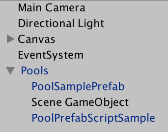

# [Custom Assets](http://www.askowl.net/unity-customassets-package)

## Executive Summary


* {:toc}

> Read the code in the Examples Folder and run the Example scene

## Introduction

## Asset Pooling
Unity3D games can run on lightweight platforms such as phones, tablets and consoles. Virtual or augmented reality games are immersive, and the least stutter in frame-rate is clear and annoying. Two of the most prominent culprits during gameplay are instantiating many complex objects and garbage collection.

`Instantiate()` and `Destroy()` aren't evil, but using them has a large impact on performance. The solution is to use a pool of these objects. It minimises expensive instantiation, and the garbage collector does not have to reclaim the memory for every usage.

A GameObject becomes a pool of it has the `Pool` script attached. Any child object becomes candidates for pooling. Drag the ***Askowl/Assets/Prefabs/Pools*** prefab into the hierarchy. You can have as many pools as you wish and they may live in any scene. The names have to be unique.



In this example, three GameObjects are pooling aware. ***Scene GameObject*** is in the scene, while the other two copies of the same prefab with differing values in editor-available fields. They represent two different characters or effects that differ.

To retrieve a clone from the pool, use `Acquire()`. Cloning of a new GameObject from the master occurs if the pool is empty.

To release an object back to the pool, disable it.

```C#
myClone.gameObject.SetActive(false);
```
Never call `Destroy()` unless you don't want to reused the GameObject. A destroyed object does not return to the pool.

### Acquire GameObject by Name
Calling `Acquire` with the name of the GameObject retrieves a clone from the pool, instantiating a new one. `Pool.Acquire("Scene GameObject")` does the trick, or returns null if the Pool did not contain an original by that name.

Seeding some of the GameObject information using optional parameters is possible.

### Transform parent
A visual effect has the target as the parent, while a character may have a spawn point or a team leader. Position and rotation below are relative to that of the parent.

### Vector3  position
The location where the clone spawns relative to the parent. It defaults to (0, 0, 0).

### Quaternion rotation
The facing direction, relative to the parent.

### bool enable
Defaults to true to enable  the clone when taken from the pool or created.

### bool poolOnDisable
PoolOnDisable also defaults to true. Using `SetActive(false)` to disable a component causes it to return to the pool. To enable and disable and as part of game processing, set `poolOnDisable` to false. Use `Pool.Return(clone)` to release the GameObject to the pool for reuse.

```C#
    for (int i = 0; i < 21; i++) {
      prefab1[i] =
        Pool.Acquire<PoolPrefabScriptSample>("PoolSamplePrefab",
                                             parent: FindObjectOfType<Canvas>().transform,
                                             position: new Vector3(x: i * 60, y: i * 60));
    }
```

### Acquire GameObject by Type
The generic form of `Acquire` is a shortcut to get a component.
```C#
PoolPrefabScriptSample script = Pool.Asquire<PoolPrefabScriptSample>();
// is the same as
script = Pool.Asquire<PoolPrefabScriptSample>("PoolPrefabScriptSample");
// is the same as
GameObject clone = Acquire(typeof(T).Name);
script = (clone == null) ? null : clone.GetComponent<T>();
```
The same optional parameters are available as the non-generic game object, adding name so you can return a prefab with a different name to the MonoBehaviour inside.

### PoolFor
Only in testing is it necessary to retrieve an item from a pool. 
Provide the string name of the master GameObject used to create the pool. The instance returns are of `PoolQueue` and provide two public interfaces.

1. public GameObject Master;
1. public GameObject Fetch();

Since `PoolQueue` is a C# `Queue` class, it inherits all those access and processing methods and fields.
