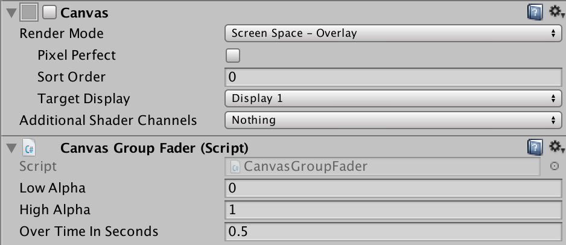
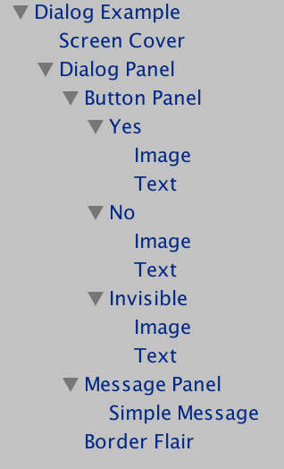
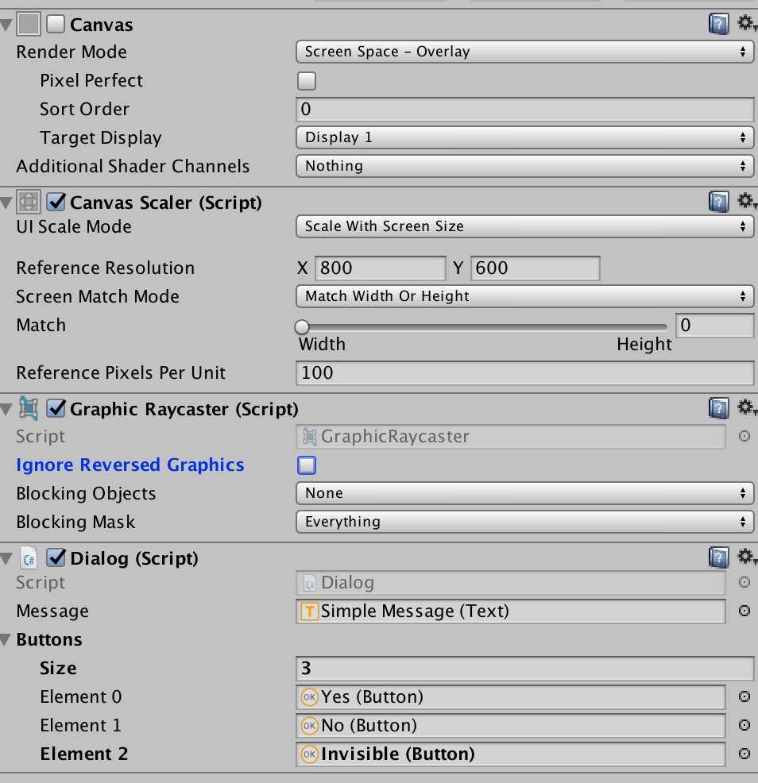
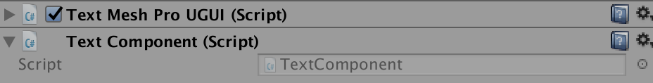

* Table of Contents
{:toc}
> Read the code in the Examples Folder.

#CanvasGroupFader
A CanvasGroupFader is a MonoBehaviour that you can add as a component to a canvas and any children.

To use it, get a reference to the canvas and call the static functions `CanvasGroupFader.FadeIn(canvas)` and `CanvasGroupFader.FadeOut(canvas)`. If the canvas does not have a CanvasGroupFader component, these functions will enable or disable the canvas. If the canvas has a CanvasGroupFader component, all the child UI elements are scanned and faded in and out in sequence.



For each CanvasGroupFader component, you can set the alpha range and the time it takes to move between them. Only if the minimum alpha is zero will the canvas be disabled.

By using a MonoBehaviour, it would be possible to have a canvas pulse in intensity on an event.

```c#
IEnumerator Pulse(canvas) {
  Coroutine waitForOneSecond = new WaitForSeconds(1);
  for (int i = 0; i < 3; i++) {
    CanvasGroupFader.FadeIn(canvas);
    yield return waitForOneSecond;
    CanvasGroupFader.FadeOut(canvas);
  }
}
```

# Dialog

***Dialog.cs*** provides similar functionality to a dialog box on Windows, OS X or the web. It displays some rich text and a series of buttons. You provide the look and feel while ***Dialog.cs*** provides the functionality.

## The Dialog GameObject

Drag the sample prefab in *Askowl-UI/Examples/Prefab* and modify it to make your own.



In this prefab, the root game object is a canvas with the ***Dialog*** script attached. Drag each of the ***Button*** game objects into the ***Buttons*** array. Drag the Text object inside the message panel to the ***Message*** field.



Everything else is just icing. The screen cover makes the dialogue modal. Game action will continue behind unless you change the time scale to zero. In this example, two buttons are set by the script while the dialogue box has room for three buttons. The third remains hidden.

## Using the *Dialog* Script

Fetch an instance of the dialogue script when you need it. Do not cache it.

```c#
Dialog dialog = Dialog.Instance("Dialog Example");
```

 This function will return *null* if it can't find the named game object or the dialogue script attached. The log receives an error message.

### Synchronous Activation

Most of the time you will want to display a message and wait for the player to respond by pressing one of the buttons. `Activate` takes one string for the news and one for each button to be displayed. Run inside a coroutine.

```c#
yield return dialog.Activate(message, "Yes Sir", "Not Now");
```

### Asynchronous Display

If your use case requires other processing, such as terminating after a specific time without a response, use `Show`, `action` and `Hide`.

```c#
dialog.Show(message, "Yes Sir", "Not Now");
float endTime = Time.realtimeSinceStartup + 30.0f // 30 seconds
while (dialog.action == null && Time.realtimeSinceStartup < endTime) {
  yield return null;
}
```

### Acting on Player Response

`Dialog.action`is a string containing the name of the game object that is the pressed button. Note that it is not the text of the button as that may change.

```c#
if (dialog.action == "Yes") {
  Debug.Log("Affirmative");
} else if (dialog.action == "No") {
  Debug.Log("Negative");
} else {
  Debug.LogError("Unexpected button: '" + dialog.action + "'");
}
```

And that is all there is to it. Have fun.

# Scroller

A ```Scroller``` is a class that allows a content 2D rectangular region to move through a viewport rectangle in a defined direction and at a defined speed.

It is easier to show than explain. Open the Askowl-Lib-Example scene and press the ***Scroller Example*** button. A green rectangle representing the viewport will appear. Wait, and another button will drift from the lower right to the upper left.

To have the content visible only in the viewport, give the viewport panel a ***Rect Mask 2D*** component.

The MonoBehaviour ```Start``` method creates a new scroller from the RectTransform of the components provided. I then set the stepping so that the content will move up and left at 45 degrees. Using pixels per second means that the speed will vary drastically between displays of different resolutions.

```c#
public class ScrollerExample : MonoBehaviour {

  public GameObject viewport;
  public GameObject content;
  public int pixelsPerSecond = 100;

  Scroller scroller;
  bool active = false;

  void Start() {
    scroller = new Scroller (
        viewport.GetComponent<RectTransform>(),
        content.GetComponent<RectTransform>());
    scroller.step.x = -1; // moves left to right
    scroller.step.y = 1; // moves bottom to top
  }

  void Update() {
    if (active) {
      if (!scroller.Step(pixelsPerSecond * Time.fixedUnscaledDeltaTime)) {
        viewport.SetActive(false);
        active = false;
      }
    }
  }

  public void ButtonPressed() {
    viewport.SetActive(true);
    active = true;
  }
}
```

To have the content follow a non-linear path, recalculate the step after each update. Note that ```scroller.Step``` returns true while the content approaches or is in the viewport.

# Sprites

## Cache

The Cache class is all about a SpriteAtlas, and a memory leak in Android. Many 2D games use a series of images to create animation. 

Due to sprite compression limitations (width and height must be a power of two), keeping the sprite in the project as individual files causes a bloated app. When it exceeds 100Mb, the Google Play Store refuses to accept it.

One solution is to combine all the images into a SpriteAtlas. Unity3D does this automatically. Give it some files or directories and get a single file to load.

Now, if we have a character walking along at 60 frames a second, we are loading 60 sprites from the atlas in a second while cycling through the images that make us the walk animation.

Surely the SpriteAtlas is optimised. It may well be, but with Unity3D 2017 this creates a memory leak in the Native Android (C++) heap. The Java heap is ok. Only when we drop to the C++ layer deep inside the Android kernel, do things go awry. It is probably due to optimisation for graphics display - and may very well be hardware specific.

The symptom is an app that quits and goes back to the Android front page without any message at any level. It is just as if you had pressed the quit button if there was one. Android is behaving itself. Android terminates an app if it is taking too much native heap. Usually, this is reasonably transparent to the user with background apps. Switching back to them takes a bit longer. What the user sees depends on the quality of state persistence. When Android terminates a foreground application, then it is a tiny bit more obvious.

Don't ask how long it took me to track this little fellow down. Fortunately caching the sprites resolves the issue.

```c#
public SpriteAtlas spriteAtlas;

Sprite.Cache atlas;

void Start() {
  atlas = Sprite.Cache.Atlas(spriteAtlas);
}

Sprite getSprite(string name) {
  if (atlas.sprites.Contains(name) {
    return atlas.sprites[name];
  }
  return null;
}
```

## Contents

In most normal cases sprites are provided as-is for the 2D application. There are cases where you need the texture the asset contains using `sprite.texture`. For one in an atlas, however, this will point the atlas. Internal sprite-aware processes use the member `TextureRect` for the offset. Great, but a pure `Texture2D` does not have an offset. The example below extracts a texture by reference or atlas/name.

```c#
    Sprites.Cache cache = Sprites.Cache.Atlas(spriteAtlas);
    Sprite attack1 = cache.sprite ["Attack_1"];

    Texture2D texture1a = Sprites.Contents.Texture(attack1);
    Assert.NotNull(texture1a);

    Texture2D texture1b = Sprites.Contents.Texture(spriteAtlas, "Attack_1");
    Assert.NotNull(texture1b);

    Assert.AreEqual(texture1a.imageContentsHash, texture1b.imageContentsHash);
```

# TextComponent
Code that wants to update a text component would normally have to know if that component was of class `Text` or `TextMeshProUGUI`. The problem compounded if there is no TextMeshPro package in the project as the referencing code would fail to compile.

`Askowl.TextComponent` is a MonoBehaviour you can add as a component to a text GameObject. Referencing it instead of the text object allows decoupled access.



```c#
    [SerializeField] private TextComponent message;
    [SerializeField] private Button      button;

    message.text = "Empty";
    buttons.GetComponentInChildren<TextComponent>().text = "OK";
```

***Askowl.UI*** includes Unity3D Editor support that adds or removes a preprocessor value `TextMeshPro` based on the existence or not of the package. Use this if you want to do additional processing on the text depending on availability of the TextMeshPro package.

```c#
if TextMeshPro
      tmpComponent = GetComponent<TextMeshProUGUI>();

      if (tmpComponent != null) {
        tmpComponent.enableKerning = true;
      }
endif
```
